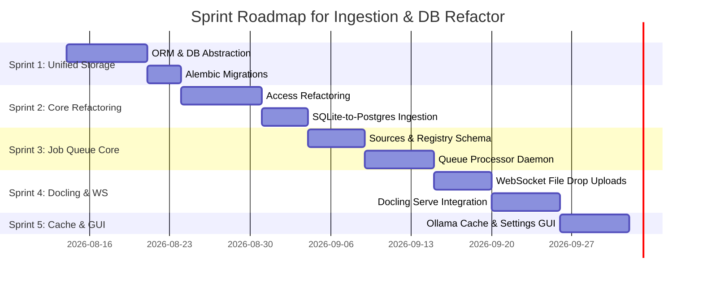

# Issue Breakdown Analysis: #29 and #30

This document breaks down the remaining scope of **Issue #29** (Import Process Needs Major Refactor) and **Issue #30** (PostgreSQL | SQLAlchemy Support) into actionable, granular sub-issues.

---

## Breakdown of Issue #29: Ingestion Pipeline & Job-Queue Refactor

The remaining portions of Issue #29 (excluding the completed duplicate checks and video download triggers) focus on transitioning the linear import process to a background job-queue architecture, handling large file drops via WebSockets, caching Ollama logs/prompts, and exposing settings in the Admin panel.

### 1. [Sub-Issue] Top-Level Ingestion Sources & Processing Registry Schema
* **Parent**: #29
* **Description**: Create a top-level unified database structure to model all import sources and register processing services.
* **Requirements**:
  - Define a new `sources` table containing:
    - `id`: UUID (Primary Key, uuid4 generated)
    - `url`: Text (Nullable, unique target url)
    - `file_hash`: Text (Nullable, uploaded file content hash for deduplication)
    - `type`: Text (source_type enum: `file`, `article`, `youtube_video`, `note`, `link`, `code_folder`, `git_clone_url`)
    - `processor_id`: Integer (Nullable, FK referencing `_processor_xref` table)
    - `path`: Text (Nullable, path on server)
    - `timestamp`: Text/DateTime (creation datetime)
  - Define a `_processor_xref` registry table to register pre-processing, processing, and post-processing services (code actions or stored procedures) for different types of inputs.
  - Relate all database entities (such as fetched pages, chunk embeddings, videos) back to their corresponding row in the `sources` table.
  - Implement helper CRUD operations in `src/kb_web/db.py`.

### 2. [Sub-Issue] State-Driven Job Queue Processor Daemon
* **Parent**: #29
* **Description**: Implement a worker thread/service to run tasks by driving items through the registered processing stages.
* **Requirements**:
  - Implement a background loop or worker thread service (e.g. in `server.py` or as a separate daemon) that polls the `sources` table for items requiring processing.
  - Execute the corresponding service dynamically based on the current `processor_id` using the `_processor_xref` registry.
  - Upon successful completion of each stage in the processing pipeline, update the `processor_id` of the source item to point to the next registered processor.
  - Hook up Gotify notification hooks to dispatch alerts containing exact error traces and recovery hints if a processing stage fails.

### 3. [Sub-Issue] WebSocket File Ingestion & Drag-and-Drop Ingestion UI
* **Parent**: #29
* **Description**: Support large document uploads (250MB+) using WebSockets for stable progress transmission.
* **Requirements**:
  - Add a drag-and-drop file upload target area to the Import UI (`url_import.j2.html`).
  - Implement a FastAPI WebSocket route `/api/import/file/upload` to receive chunks of large files.
  - Emit real-time upload progress indicators back to the client-side UI before saving the original file on disk and enqueuing a docling-serve job.

### 4. [Sub-Issue] Standalone Ollama Chat Caching, Prompts Logs, & Settings Management
* **Parent**: #29
* **Description**: Create a logging cache and advanced settings configuration panel for Ollama model interactions.
* **Requirements**:
  - Design an `ollama_chat_cache` table storing `prompt_hash` (PK), `raw_prompt`, `raw_response_json`, `model_used`, and `settings_applied`.
  - Refactor all Ollama Client calls to search this cache before executing remote queries.
  - Expose advanced kwargs for `ollama.chat` in the Admin Dashboard, loading parameters dynamically from the database and using defaults if empty (omitting empty keys in python dict).
  - Expose a prompt history view left-joined against generated responses in the Admin Portal.

---

## Breakdown of Issue #30: PostgreSQL & SQLAlchemy Support (Sub-Issue of #29)

> [!NOTE]
> Issue #30 is associated with parent Issue #29 on GitHub as a sub-issue (`gh issue edit 30 --parent 29`).
> Transitioning the storage layer from `sqlite-utils` to SQLAlchemy is required to support PostgreSQL, which fits into the overall database refactoring phase of the ingestion and core pipeline. Since `sqlite-utils` uses dictionary-based row mutations, database access must be abstracted to ORM models supporting both SQLite and PostgreSQL dialects.

### 5. [Sub-Issue] SQLAlchemy ORM Schema Definition
* **Parent**: #30
* **Description**: Declare SQLAlchemy models for all database tables and views.
* **Requirements**:
  - Translate the active SQLite schema definitions (including `fetched_pages`, `page_versions`, `site_wikis`, `youtube_videos`, `collections`, `collection_items`, `links`, `settings_ollama`, etc.) into SQLAlchemy Declarative Base models.
  - Map foreign key constraints, indexes, and unique constraints.
  - Configure views (`vault_master`, `repo_master`, `valid_repo_files`, etc.) as read-only SQLAlchemy models or mapping wrappers.

### 6. [Sub-Issue] Database Session & Driver Abstraction
* **Parent**: #30
* **Description**: Enable configuration-driven dialect selection supporting SQLite and PostgreSQL backends.
* **Requirements**:
  - Add `DATABASE_URL` (e.g. `postgresql://...`) to `Config`.
  - Implement SQLAlchemy connection engines, thread-scoped session managers, and transaction lifecycle middleware in `base.py`.
  - Integrate PostgreSQL connection pooling features (`pool_size`, `max_overflow`).

### 7. [Sub-Issue] Database Access Refactoring
* **Parent**: #30
* **Description**: Refactor all direct SQLite query instances to ORM methods.
* **Requirements**:
  - Systematically replace dictionary-based tables syntax (e.g. `db["fetched_pages"].upsert(...)` or `db.execute(...)`) with type-safe SQLAlchemy session queries across the router endpoints (`pages.py`, `admin.py`, `links.py`, `collections.py`, `cli_api.py`, `api.py`).

### 8. [Sub-Issue] Schema Migration Engine (Alembic Integration)
* **Parent**: #30
* **Description**: Add migrations versioning framework to manage database upgrades.
* **Requirements**:
  - Initialize Alembic within the repository.
  - Support automatic migration script generation by comparing active SQLAlchemy models against the targeted database schema.
  - Implement programmatic migrations check on server startup.

### 9. [Sub-Issue] SQLite-to-PostgreSQL Data Ingest Utility
* **Parent**: #30
* **Description**: Build a database translation CLI command to import SQLite dump rows to PostgreSQL.
* **Requirements**:
  - Create a new CLI command `kb-cli db migrate-to-postgres` that reads all tables from a local `kb.db` file, maps schemas, and bulk-inserts records into the configured PostgreSQL target database.

---

## Sprints & Implementation Plan

We group the proposed sub-issues and Issue #36 into 5 sequential sprints:

### Sprint 1: Unified Storage Layer (SQLAlchemy ORM & Migrations)
* **Goal**: Establish a dialect-agnostic ORM schema and migration engine.
* **Target Sub-Issues**:
  - **Sub-Issue 5**: SQLAlchemy ORM Schema Definition
  - **Sub-Issue 6**: Database Session & Driver Abstraction
  - **Sub-Issue 8**: Schema Migration Engine (Alembic Integration)
* **Implementation Plan**:
  1. Define database models in `src/kb_web/models_orm.py` using SQLAlchemy.
  2. Implement SQLite/PostgreSQL connection engines and session logic in `src/kb_web/base.py`, configuring connection pooling parameters.
  3. Initialize Alembic, configure migration environments supporting both SQLite and PostgreSQL dialects, and autogenerate the base schema migration script.

### Sprint 2: Core Database Access Refactoring & Data Migration Utility
* **Goal**: Port existing codebase queries to SQLAlchemy and provide a data migration helper.
* **Target Sub-Issues**:
  - **Sub-Issue 7**: Database Access Refactoring
  - **Sub-Issue 9**: SQLite-to-PostgreSQL Data Ingest Utility
* **Implementation Plan**:
  1. Refactor table operations across all endpoints (in `pages.py`, `admin.py`, `links.py`, `collections.py`, `cli_api.py`, `api.py`) to execute SQLAlchemy ORM session methods instead of direct dictionary `sqlite_utils` mutations.
  2. Implement the `kb-cli db migrate-to-postgres` CLI command to extract data from an existing SQLite `kb.db` file and populate the PostgreSQL target.

### Sprint 3: Processing Sources Schema & State-Driven Job Queue Processor
* **Goal**: Build the unified sources schema and state-driven background queue daemon.
* **Target Sub-Issues**:
  - **Sub-Issue 1**: Top-Level Ingestion Sources & Processing Registry Schema
  - **Sub-Issue 2**: State-Driven Job Queue Processor Daemon
* **Implementation Plan**:
  1. Add the SQLAlchemy mapping for the unified `sources` table and the `_processor_xref` service registry.
  2. Register existing ingestion tasks (fetch, summary, tags, embeddings, downloads) inside the `_processor_xref` registry.
  3. Write a background daemon thread that polls `sources` requiring processing, runs the mapped service, and increments `processor_id` to drive items through processing stages.

### Sprint 4: WebSocket Document Ingestion & Docling-Serve Integration
* **Goal**: Support drag-and-drop document uploads via WebSockets and docling API conversion.
* **Target Issues**:
  - **Issue #36**: Add `docling-serve` Support and File Imports
  - **Sub-Issue 3**: WebSocket File Ingestion & Drag-and-Drop Ingestion UI
* **Implementation Plan**:
  1. Build a drag-and-drop document upload box in the Import page frontend.
  2. Implement a FastAPI WebSocket route to handle chunked uploads for large documents (250MB+).
  3. Integrate the `docling-serve` API client to convert files (PDFs, Docx, etc.) to markdown/JSON, save raw file contents, and schedule embedding tasks via the job queue.

### Sprint 5: Ollama Cache & Advanced Settings Dashboard
* **Goal**: Prevent duplicate LLM calls by caching prompts and managing options dynamically.
* **Target Sub-Issues**:
  - **Sub-Issue 4**: Standalone Ollama Chat Caching, Prompts Logs, & Settings Management
* **Implementation Plan**:
  1. Set up SQLAlchemy maps for the `ollama_chat_cache` table.
  2. Intercept Ollama client chat queries to verify cache hit before execution.
  3. Build Admin settings configuration forms for advanced `ollama.chat` kwargs and apply saved parameters in the pipeline.
