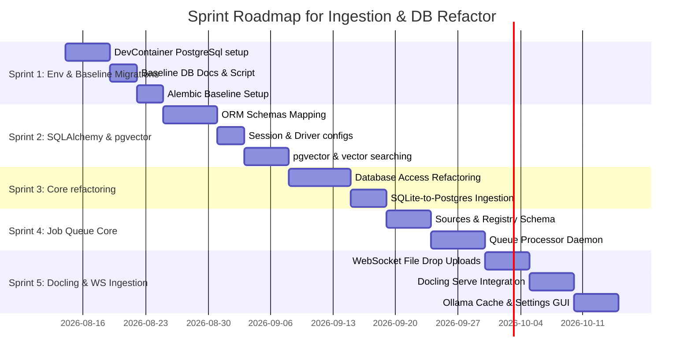

# Issue Breakdown Analysis: #29 and #30

This document breaks down the remaining scope of **Issue #29** (Import Process Needs Major Refactor) and **Issue #30** (PostgreSQL | SQLAlchemy Support) into actionable, granular sub-issues.

---

## Phase 1: Database Baseline, Dev Environment, & Migrations CI/CD

Before modifying any python code, we must establish the PostgreSQL development environment, document the database schema, construct a baseline migration matching the current SQLite state, and integrate the deployment pipeline.

### 0. [Sub-Issue] DevContainer PostgreSQL & pgvector Environment Setup
* **Parent**: #30
* **Description**: Create a local development container with a PostgreSQL database containing the `pgvector` extension, and set up a CI/CD build configuration.
* **Requirements**:
  - Add a `.devcontainer/devcontainer.json` and `docker-compose.yml` to define a workspace with a service container for PostgreSQL (using the `pgvector/pgvector:pg16` Docker image).
  - Configure the environment variables (`DATABASE_URL`, `POSTGRES_DB`, `POSTGRES_USER`, `POSTGRES_PASSWORD`).
  - Extend the CI/CD pipeline (`build.py` or testing workflow) to start this containerized DB, run database health checks, and run unit tests against PostgreSQL in testing environments.

### 1. [Sub-Issue] Database Schema Documentation & Baseline SQL Ingestion
* **Parent**: #30
* **Description**: Create comprehensive documentation of the database schema and extract the baseline SQLite schema layout.
* **Requirements**:
  - Write a markdown database documentation file `docs/database_schema.md` describing all tables, column types, foreign keys, constraints, and views.
  - Export a clean SQL dump of the current SQLite schema as a baseline SQL script `migrations/baseline_sqlite.sql` representing the current production database state.

### 2. [Sub-Issue] Alembic Baseline Migration & Deployment Scripts
* **Parent**: #30
* **Description**: Set up the Alembic migration framework and create deployment scripts to apply migrations automatically.
* **Requirements**:
  - Initialize Alembic under `migrations/` inside the repository.
  - Create the initial baseline migration script in Alembic representing the baseline table schema (so migrations can be seeded from the baseline state).
  - Write a Python deployment script `scripts/deploy_migrations.py` to check for pending migrations and execute them against the target database on server startup.

---

## Phase 2: SQLAlchemy ORM, pgvector, & Dialect Abstraction

With the baseline migrations and DevContainer environment in place, we can construct the SQLAlchemy ORM models, session abstraction layer, and implement vector embeddings queries utilizing PostgreSQL's native `pgvector` extension.

### 3. [Sub-Issue] pgvector Extension Integration & Embeddings Refactor
* **Parent**: #30
* **Description**: Adapt embedding tables to use the `pgvector` extension and refactor vector similarity searches.
* **Requirements**:
  - Update the base database initialization to run `CREATE EXTENSION IF NOT EXISTS vector;` on PostgreSQL targets.
  - Map `article_embeddings`, `video_embeddings`, and `chunk_embeddings` tables to use the `pgvector.sqlalchemy.Vector` type for the embedding vector columns (instead of text columns containing JSON strings).
  - Refactor all vector search operations (e.g. in `utils.py` and `pages.py`) to execute native cosine/L2 distance search queries (such as `<->` or `<=>` operator functions) in SQLAlchemy.

### 4. [Sub-Issue] SQLAlchemy ORM Schema mapping
* **Parent**: #30
* **Description**: Declare SQLAlchemy models for all database tables and views.
* **Requirements**:
  - Translate the SQLite table definitions (including `fetched_pages`, `page_versions`, `site_wikis`, `youtube_videos`, `collections`, `collection_items`, `links`, `settings_ollama`, etc.) into SQLAlchemy Declarative Base models.
  - Map foreign key constraints, indexes, and unique constraints.
  - Configure views (`vault_master`, `repo_master`, `valid_repo_files`, etc.) as read-only SQLAlchemy mapping wrappers.

### 5. [Sub-Issue] Database Session & Driver Abstraction
* **Parent**: #30
* **Description**: Enable configuration-driven dialect selection supporting SQLite and PostgreSQL backends.
* **Requirements**:
  - Add `DATABASE_URL` (e.g. `postgresql://...`) to `Config`.
  - Implement SQLAlchemy connection engines, thread-scoped session managers, and transaction lifecycle middleware in `base.py`.
  - Configure PostgreSQL connection pooling features (`pool_size`, `max_overflow`).

---

## Phase 3: Core Refactoring & SQLite Data Migration

With ORM models and `pgvector` searches complete, we can update direct database queries in the application and provide a tool to migrate existing SQLite databases.

### 6. [Sub-Issue] Database Access Refactoring
* **Parent**: #30
* **Description**: Refactor all direct SQLite query instances to ORM methods.
* **Requirements**:
  - Systematically replace dictionary-based tables syntax (e.g. `db["fetched_pages"].upsert(...)` or `db.execute(...)`) with type-safe SQLAlchemy session queries across the router endpoints (`pages.py`, `admin.py`, `links.py`, `collections.py`, `cli_api.py`, `api.py`).

### 7. [Sub-Issue] SQLite-to-PostgreSQL Data Ingest Utility
* **Parent**: #30
* **Description**: Build a database translation CLI command to import SQLite dump rows to PostgreSQL.
* **Requirements**:
  - Create a new CLI command `kb-cli db migrate-to-postgres` that reads all tables from a local `kb.db` file, maps schemas, and bulk-inserts records into the configured PostgreSQL target database.

---

## Phase 4: Processing Sources Schema & State-Driven Job Queue Processor

Refactor the ingestion pipeline to transition from a linear flow to a state-driven queue processor utilizing the top-level sources table.

### 8. [Sub-Issue] Top-Level Ingestion Sources & Processing Registry Schema
* **Parent**: #29
* **Description**: Create a top-level unified database structure to model all import sources and register processing services.
* **Requirements**:
  - Define a new `sources` table containing:
    - `id`: UUID (Primary Key, uuid4 generated)
    - `url`: Text (Nullable, unique target url)
    - `file_hash`: Text (Nullable, uploaded file content hash for deduplication)
    - `type`: Text (source_type enum: `file`, `article`, `youtube_video`, `note`, `link`, `code_folder`, `git_clone_url`)
    - `processor_id`: Integer (Nullable, FK referencing `_processor_xref` table)
    - `path`: Text (Nullable, path on server)
    - `timestamp`: Text/DateTime (creation datetime)
  - Define a `_processor_xref` registry table to register pre-processing, processing, and post-processing services (code actions or stored procedures) for different types of inputs.
  - Relate all database entities (such as fetched pages, chunk embeddings, videos) back to their corresponding row in the `sources` table.
  - Implement helper CRUD operations in `src/kb_web/db.py`.

### 9. [Sub-Issue] State-Driven Job Queue Processor Daemon
* **Parent**: #29
* **Description**: Implement a worker thread/service to run tasks by driving items through the registered processing stages.
* **Requirements**:
  - Implement a background loop or worker thread service (e.g. in `server.py` or as a separate daemon) that polls the `sources` table for items requiring processing.
  - Execute the corresponding service dynamically based on the current `processor_id` using the `_processor_xref` registry.
  - Upon successful completion of each stage in the processing pipeline, update the `processor_id` of the source item to point to the next registered processor.
  - Hook up Gotify notification hooks to dispatch alerts containing exact error traces and recovery hints if a processing stage fails.

---

## Phase 5: WebSocket Ingestion, Docling integration, & Cache Settings

The final stage completes the files upload features (large uploads via WebSocket, docling service) and Ollama options caching/dashboard logs.

### 10. [Sub-Issue] WebSocket File Ingestion & Drag-and-Drop Ingestion UI
* **Parent**: #29
* **Description**: Support large document uploads (250MB+) using WebSockets for stable progress transmission.
* **Requirements**:
  - Add a drag-and-drop file upload target area to the Import UI (`url_import.j2.html`).
  - Implement a FastAPI WebSocket route `/api/import/file/upload` to receive chunks of large files.
  - Emit real-time upload progress indicators back to the client-side UI before saving the original file on disk and enqueuing a docling-serve job.

### 11. [Sub-Issue] Standalone Ollama Chat Caching, Prompts Logs, & Settings Management
* **Parent**: #29
* **Description**: Create a logging cache and advanced settings configuration panel for Ollama model interactions.
* **Requirements**:
  - Design an `ollama_chat_cache` table storing `prompt_hash` (PK), `raw_prompt`, `raw_response_json`, `model_used`, and `settings_applied`.
  - Refactor all Ollama Client calls to search this cache before executing remote queries.
  - Expose advanced kwargs for `ollama.chat` in the Admin Dashboard, loading parameters dynamically from the database and using defaults if empty (omitting empty keys in python dict).
  - Expose a prompt history view left-joined against generated responses in the Admin Portal.

---

## Sprints & Implementation Plan

We group the proposed sub-issues and Issue #36 into 5 sequential sprints:

### Sprint 1: Dev Environment, Database Baseline, & Deployment CI/CD (The Very First Sprint)
* **Goal**: Configure local DevContainer PostgreSQL, baseline DB documentation, and Alembic baseline migrations CI/CD deployment logic.
* **Target Sub-Issues**:
  - **Sub-Issue 0**: DevContainer PostgreSQL & pgvector Environment Setup
  - **Sub-Issue 1**: Database Schema Documentation & Baseline SQL Ingestion
  - **Sub-Issue 2**: Alembic Baseline Migration & Deployment Scripts
* **Implementation Plan**:
  1. Define docker-compose configurations mapping a PostgreSQL database utilizing the `pgvector` container image (`pgvector/pgvector:pg16`).
  2. Implement build-pipeline integration inside `build.py` to start and check connections to local PostgreSQL during CI processes.
  3. Write `docs/database_schema.md` mapping tables, types, keys, and views. Export the active SQLite schema to `migrations/baseline_sqlite.sql`.
  4. Initialize Alembic, prepare the baseline migration configuration, and write automated Python deployment routines under `scripts/deploy_migrations.py`.

### Sprint 2: SQLAlchemy ORM Schema & pgvector Searches
* **Goal**: Establish the SQLAlchemy ORM models, session pool configurations, and pgvector operations.
* **Target Sub-Issues**:
  - **Sub-Issue 4**: SQLAlchemy ORM Schema mapping
  - **Sub-Issue 5**: Database Session & Driver Abstraction
  - **Sub-Issue 3**: pgvector Extension Integration & Embeddings Refactor
* **Implementation Plan**:
  1. Declare SQLAlchemy ORM base classes mapping all tables and index definitions, wrapping views as read-only.
  2. Setup engine parameters and connection session pools for PostgreSQL/SQLite in `base.py`.
  3. Map embeddings to `pgvector.sqlalchemy.Vector` types.
  4. Refactor similarity search operations (in `utils.py` and `pages.py`) to execute native L2/cosine distance queries in SQLAlchemy.

### Sprint 3: Core Database Access Refactoring & Data Migration Utility
* **Goal**: Port existing codebase queries to SQLAlchemy sessions and build the data migration helper.
* **Target Sub-Issues**:
  - **Sub-Issue 6**: Database Access Refactoring
  - **Sub-Issue 7**: SQLite-to-PostgreSQL Data Ingest Utility
* **Implementation Plan**:
  1. Refactor all repository dictionary-based SQLite operations across router handlers and CLI to ORM sessions.
  2. Implement the `kb-cli db migrate-to-postgres` CLI command to bulk load SQLite data into PostgreSQL.

### Sprint 4: Unified Processing Sources Schema & Job Queue Processor Daemon
* **Goal**: Implement the unified sources schema and state-driven queue processor daemon.
* **Target Sub-Issues**:
  - **Sub-Issue 8**: Top-Level Ingestion Sources & Processing Registry Schema
  - **Sub-Issue 9**: State-Driven Job Queue Processor Daemon
* **Implementation Plan**:
  1. Add the SQLAlchemy mapping for the unified `sources` table and the `_processor_xref` service registry.
  2. Register existing ingestion tasks (fetch, summary, tags, embeddings, downloads) inside the `_processor_xref` registry.
  3. Write a background daemon thread that polls `sources` requiring processing, runs the mapped service, and increments `processor_id` to drive items through processing stages.

### Sprint 5: WebSocket Ingestion, Docling integration, & Cache Settings
* **Goal**: Drag-and-drop document upload via WebSockets, docling api conversions, Ollama prompt caching, and settings dashboard.
* **Target Issues & Sub-Issues**:
  - **Issue #36**: Add `docling-serve` Support and File Imports
  - **Sub-Issue 10**: WebSocket File Ingestion & Drag-and-Drop Ingestion UI
  - **Sub-Issue 11**: Standalone Ollama Chat Caching, Prompts Logs, & Settings Management
* **Implementation Plan**:
  1. Build a drag-and-drop document upload box in the Import page.
  2. Implement a FastAPI WebSocket route to handle chunked uploads for large documents (250MB+).
  3. Integrate the `docling-serve` API client to convert files (PDFs, Docx, etc.) to markdown/JSON, save raw file contents, and schedule embedding tasks.
  4. Set up `ollama_chat_cache` cache logic and the Admin settings forms for advanced `ollama.chat` kwargs.
