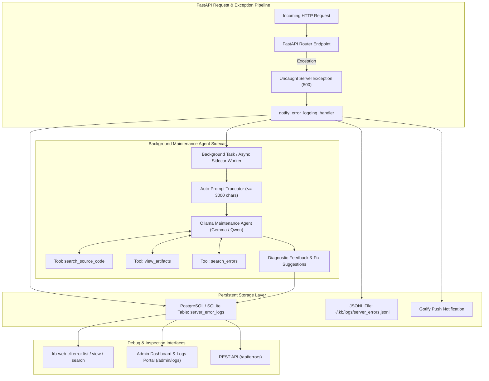

# Implementation Plan: Taxonomy Schema Fix, Error Logging, and Background Maintenance Agent Sidecar

This implementation plan details the resolution of the `taxonomy_items.item_class` database error, the server-side persistent error logging system, and the background Maintenance Agent sidecar with source code search, artifact viewing, error search, and auto-prompting on uncaught server exceptions.

---

## 1. Problem Statement & Root Cause

1. **Undefined Column `taxonomy_items.item_class`**:
   - **Error**: `(psycopg2.errors.UndefinedColumn) column taxonomy_items.item_class does not exist` on `GET /taxonomy`.
   - **Root Cause**: In `src/kb_web/models_orm.py` (`ensure_views_and_indexes`), the defensive check to add `item_class` was located exclusively under the `else:` branch (SQLite PRAGMA table_info) and was omitted from the PostgreSQL block. In environments where `taxonomy_items` was created prior to `f92d84291a25`, the column was never added.
   - **User Directive**: "okay add the migration back in,. it broke the hell out of the app." The purge in `0a9b8c7d6e5f_one_time_taxonomy_purge.py` must be restored, and PostgreSQL column verification must be applied immediately on boot.

2. **Server-Side Error Storage**:
   - Errors sent to Gotify are transient notifications and are not stored in a structured, queryable database table on the server.
   - **User Directive**: "i need these error messages (sent to gotify) to be stored on the server in a way that you can view them for debugging. this could be a CLI route idk".

3. **Background Sidecar Maintenance Agent**:
   - **User Directive**: "I need errors to trigger the agent to give imeadiate feedback before I even get to fixing it. e.g. I want to have an agent that is for maintaining the website. I want to give it a tool to search the source code. I want it to have a tool to view the artifacts. I wantto have it auto prompted with errors (limit it to 3000 characters and give it a tool to search the errors for terms) this should all be a side car thing that can run in the background."

---

## 2. Architectural Design



---

## 3. Database Schema & Migration Changes

### A. Schema Healing in `src/kb_web/models_orm.py`
In `ensure_views_and_indexes()`, add automatic idempotent column creation for PostgreSQL:
```sql
ALTER TABLE taxonomy_items ADD COLUMN IF NOT EXISTS item_class VARCHAR(32) DEFAULT 'Notes';
ALTER TABLE fetched_pages ADD COLUMN IF NOT EXISTS is_frozen INTEGER DEFAULT 0;
ALTER TABLE notes ADD COLUMN IF NOT EXISTS is_frozen INTEGER DEFAULT 0;
ALTER TABLE youtube_videos ADD COLUMN IF NOT EXISTS is_frozen INTEGER DEFAULT 0;
```
This guarantees immediate healing upon every server startup (`sudo systemctl restart kb-web.service`).

### B. Restore Migration `0a9b8c7d6e5f_one_time_taxonomy_purge.py`
Restore table purge statements to clean corrupted classification records, and ensure `item_class` column exists.

### C. Create `ServerErrorLog` ORM Model
In `src/kb_web/models_orm.py`:
- `id`: Integer primary key, autoincrement
- `timestamp`: ISO-8601 string
- `error_type`: String (e.g. `psycopg2.errors.UndefinedColumn`)
- `error_message`: Text
- `stack_trace`: Text
- `request_method`: String (GET, POST, etc.)
- `request_url`: Text
- `query_params`: Text (JSON string)
- `client_ip`: String
- `agent_feedback`: Text (populated by Maintenance Agent)
- `status`: String (`open`, `analyzed`, `resolved`)

### D. Alembic Migration `2c3d4e5f6a7b_add_server_error_logs_and_ensure_columns.py`
Creates `server_error_logs` table with indexes on `timestamp`, `error_type`, and `status`.

---

## 4. Maintenance Agent Engine & Tools (`src/kb_web/maintenance_agent.py`)

1. **Auto-Prompting**:
   - Takes uncaught error details, formats a structured prompt, and enforces a strict **3000-character cap** as requested.
   - Dispatches in background via FastAPI `BackgroundTasks` or sidecar thread so web requests respond immediately.

2. **Agent Tools**:
   - `search_source_code(query: str, path_filter: Optional[str] = None)`: Ripgrep/Python pattern search across `src/kb_web/`, `tests/`, `migrations/`.
   - `view_artifacts(artifact_path: Optional[str] = None)`: Reads `.artifacts/` plans, feedback logs, and `uat/reports/`.
   - `search_errors(query: str, limit: int = 5)`: Searches historical `server_error_logs` table.

3. **Feedback Storage**:
   - Saves generated diagnostic analysis and code fix recommendations directly into `server_error_logs.agent_feedback`.

---

## 5. Inspection Endpoints & CLI Commands

1. **REST API (`src/kb_web/routers/errors.py`)**:
   - `GET /api/errors`: Returns recent errors with pagination.
   - `GET /api/errors/{id}`: Returns error details and agent feedback.
   - `GET /api/errors/search?q={term}`: Search errors by message or stack trace.
   - `POST /api/errors/{id}/analyze`: Manually triggers maintenance agent re-analysis.

2. **CLI Commands (`kb-web-cli`)**:
   - `kb-web-cli error list`: Tabular list of recent server errors.
   - `kb-web-cli error view <id>`: Displays full traceback and agent diagnosis.
   - `kb-web-cli error search <term>`: Searches historical server errors.
   - `kb-web-cli maintenance-daemon`: Runs standalone background sidecar worker loop.

3. **Web UI Portal**:
   - Enhanced `/admin/logs` with an **Incident Debugger & Agent Feedback** tab showing error records and AI recommendations.

---

## 6. Verification & Testing Plan

1. **Schema Healing & Migration Test**:
   - Verify `ensure_views_and_indexes` executes without errors on PostgreSQL and SQLite.
   - Verify `GET /taxonomy` succeeds and `item_class` column is queried.
2. **Error Logging Unit Tests**:
   - Trigger simulated exceptions (e.g. `GET /api/test-error`).
   - Verify error is persisted to `server_error_logs` table and written to `~/.kb/logs/server_errors.jsonl`.
3. **Maintenance Agent Tool Unit Tests**:
   - Test `search_source_code` tool on known symbols (`def ensure_views_and_indexes`).
   - Test `view_artifacts` tool on `.artifacts/`.
   - Test `search_errors` tool on logged errors.
   - Test 3000-character truncation safeguard.
4. **CLI & Route Audit**:
   - Test `kb-web-cli error list` and `kb-web-cli error search`.
   - Run `live-server-test` route audit against `https://kb-test.willmo.dev`.
