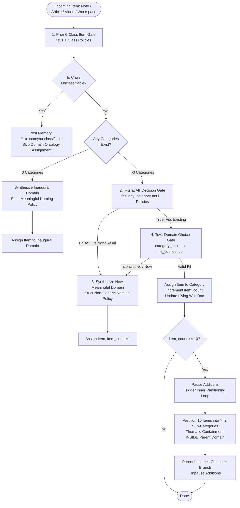

# Implementation Plan - Notes Tree Hierarchy, Meaningful Domain Names, Prior 6-Class Gating, "Fits at All" Gating, Policy Enforcement, and Migration Rollback

This implementation plan details the housekeeping updates, architectural refinements, and migration rollback before final sign-off on branch `feature/auth-cli-workspaces-agent-tev` (Draft PR #78).

---

## 1. Overview & Objectives

### A. Notes Recursive Nested Tree Hierarchy (Photo 1)
- **Problem**: In the Notes & Obsidian Vaults sidebar, folders with slash-delimited paths (e.g. `dev_notes/TESTS`, `dev_notes/SystemMessages`, `dev_notes/agent skills/uv skill`, `dev_notes/agent skills`) are displayed as flat items at the same level.
- **Solution**: Parse slash-delimited folder paths into a true recursive nested folder tree (`subfolders` and `notes`). In the UI (`notes_list.j2.html`), render nested collapsible folders using a Jinja2 macro with disclosure chevrons, folder icons, item counts, and proper hierarchical indentation.

### B. Meaningful Domain Naming & Sub-Category Containment (Photo 2)
- **Problem**: Taxonomy categories were defaulting to generic labels like `Domain 10`, `Domain 11`, `Domain 12` covering items like "Date Ideas".
- **Solution**:
  1. Strictly instruct the LLM and `tev1` that generic or numbered names (`Domain X`, `Category Y`) are strictly forbidden.
  2. Implement an intelligent domain naming fallback that extracts authoritative domain titles from item titles and tags (e.g. "Personal Lifestyle & Dating", "DevOps & Cloud Infrastructure").
  3. Enforce **Thematic Containment**: child sub-categories created during partitioning must remain strictly **INSIDE** the original chosen domain (`parent_id = category.id`) and represent specialized thematic sub-domains of that parent.

### C. Prior 6-Class Item Classification Gate
- **Requirement**: Prior to domain matching, classify incoming items into 6 distinct classes:
  - `Personal`: Personal notes, personal information, journal thoughts, date ideas.
  - `Documentation`: Code resources, reference documents, technical manuals.
  - `Notes`: General markdown notes that are not personal and not documentation or code.
  - `Articles`: Web articles, news essays, YouTube video transcripts.
  - `Source Code`: Flattened code, workspace snapshots, scripts.
  - `Unclassifiable`: Corrupted, unreadable, or unclassifiable items.
- **Action**: Add `item_class` column to `TaxonomyItem`. Run prior classification via `client.systemone` with explicit policy guidance. Skip unclassifiable items from domain ontology matching.

### D. "Fits at All" Decision Gate
- **Requirement**: Before assigning an item to any category or collection, execute an explicit decision gate checking whether the content fits into an existing category *at all*.
- **Action**: Add a `fits_any_category` (`noul`) question. If false, bypass category selection and cleanly branch to create a new meaningful domain category.

### E. Enforce "Policy" Directives in Decision Model State
- **Requirement**: Decision models perform significantly better with explicit policy directives in the `state` object.
- **Action**: Enforce structured `policies: [...]` arrays in the `state` dictionary for all `client.systemone` calls.

### F. Migration Rollback & Classification Information Purge
- **Requirement**: The user tested these features previously and wants this test version to rollback the latest migrations to remove the test classification information in the database.
- **Action**:
  1. Provide the migration script for revision `f92d84291a25` (`f92d84291a25_add_taxonomy_classification.py`) linking `e81c74291a23` -> `f92d84291a25` with bidirectional `upgrade()` and `downgrade()`.
  2. Execute `alembic downgrade e81c74291a23` against the test/dev database to cleanly drop/purge the test classification records and tables.
  3. Add CLI command `kb-web-cli db rollback` and `kb-web-cli db reset-taxonomy` to enable reproducible teardown and rebuilding across environments.

---

## 2. Architecture & State Machine Flow



---

## 3. Detailed Implementation Steps

### Step 1: Migration Rollback & Clean Teardown
1. Create `migrations/versions/f92d84291a25_add_taxonomy_classification.py`:
   - Revision ID: `f92d84291a25`
   - Down revision: `e81c74291a23`
   - `upgrade()`: creates `taxonomy_categories` and `taxonomy_items` (with `item_class` column).
   - `downgrade()`: drops `taxonomy_items` and `taxonomy_categories`, and purges `#taxonomy` agent messages.
2. Execute `alembic downgrade e81c74291a23` on the active database to cleanly rollback the database version and purge the test data.
3. Add CLI command `kb-web-cli db rollback` in `src/kb_web/cli.py` and `deploy_migrations.py`.

### Step 2: Notes Recursive Nested Tree Hierarchy
1. In `src/kb_web/routers/notes.py`:
   - Implement `_build_nested_folder_tree(notes)`:
     - Splits each note's `folder_path` (e.g. `dev_notes/agent skills/uv skill`) by `/` or `\`.
     - Builds a hierarchical structure per vault:
       ```python
       {
           "name": "agent skills",
           "path": "dev_notes/agent skills",
           "subfolders": {
               "uv skill": {
                   "name": "uv skill",
                   "path": "dev_notes/agent skills/uv skill",
                   "subfolders": {},
                   "notes": [...]
               }
           },
           "notes": [...]
       }
       ```
   - Update `list_notes_api` to return `nested_tree` and maintain backward compatibility.
   - Update `view_notes_dashboard` to pass `nested_tree` to template.
2. In `src/kb_web/templates/notes_list.j2.html`:
   - Create recursive Jinja macro `render_folder_node(folder, depth=0)`:
     - Renders `<details open class="group">` with summary: folder icon 📂, name, count badge.
     - Lists direct notes in the folder.
     - Iterates through child `subfolders` recursively with visual tree nesting (`pl-3 border-l border-indigo-100`).

### Step 3: Database Schema & Taxonomy Models
1. In `src/kb_web/models_orm.py`:
   - Add `item_class = Column(String(32), default="Notes")` to `TaxonomyItem`.
   - Update `TaxonomyItem` representation and dictionary export.

### Step 4: Prior 6-Class Item Classification Gate
1. In `src/kb_web/taxonomy_state_machine.py`:
   - Implement `classify_item_class(item_title, item_content, item_tags, client, config) -> str`:
     - Calls `client.systemone` with model `tev1`.
     - State object includes:
       - `item_title`, `item_excerpt`, `item_tags`.
       - `policies`: Explicit policy directives defining the 6 classes (Personal, Documentation, Notes, Articles, Source Code, Unclassifiable).
     - Choice question `item_class` with 6 options and criteria.
     - Fallback: Intelligent heuristics based on tags, syntax, and title.
     - If `Unclassifiable`: log observation to `#taxonomy`, save with `item_class="Unclassifiable"`, and skip domain assignment.

### Step 5: "Fits at All" Decision Gate & Policy Directives
1. In `evaluate_category_fit_tev1`:
   - Inject `policies` into `state`:
     - `Policy 1 (Thematic Purity)`: Item must only be assigned if core topic directly aligns.
     - `Policy 2 (Meaningful Domains)`: Categories represent cohesive subject domains; if none fit, must trigger new category.
     - `Policy 3 (Domain Containment)`: Sub-categories must strictly represent thematic specializations within the parent domain boundary.
     - `Policy 4 (Exclusion of Numbered Labels)`: Generic placeholders or numbered titles (e.g. 'Domain 1', 'Category 2') are strictly forbidden.
   - Add first gate question: `fits_any_category` (`noul`).
   - If `fits_any_category` is False, return `(None, False)` immediately to create a new domain.
   - If True, evaluate `category_choice` and `fit_confidence`.

### Step 6: Meaningful Domain Naming & Sub-Category Containment
1. In `_synthesize_new_category` and `_create_cold_start_category`:
   - Prompt updates: Strictly mandate 2-4 word authoritative domain titles (e.g. "Personal Lifestyle & Dating", "DevOps & Cloud Infrastructure"). Strictly forbid generic labels ("Domain X", "Category Y").
   - Fallback synthesizer `_derive_meaningful_domain_name(item_title, item_tags, item_class)`:
     - Derives a clean domain title using the item's topic and tags instead of `f"Domain {count}"`.
     - For example, "Date Ideas" -> "Personal Lifestyle & Dating".
     - Regex check: If returned name matches `^(domain|category|topic)\s*\d+$`, replace with derived name.
2. In `partition_category`:
   - Enforce **Thematic Containment**: child sub-categories must have `parent_id = category.id`.
   - Prompt LLM with strict containment instructions: child sub-categories must be thematic specializations of `{category.name}`.
   - Fallback partition generates themed child categories like `{category.name} - Concepts & Planning` and `{category.name} - Applied Resources`.

---

## 4. Testing & Verification Plan

1. **Migration Verification**:
   - Verify `uv run alembic current` accurately detects `f92d84291a25`.
   - Execute `uv run alembic downgrade e81c74291a23` and confirm classification tables/records are purged.
   - Re-upgrade to head (`uv run alembic upgrade head`) with the clean schema.
2. **Unit & Integration Tests**:
   - `tests/test_taxonomy_and_agent_memory.py`:
     - Test prior 6-class gate (`Personal`, `Documentation`, `Notes`, `Articles`, `Source Code`, `Unclassifiable`).
     - Test "fits at all" decision gate (bypasses choices when False).
     - Test meaningful naming (rejects "Domain 10" patterns and generates descriptive domain titles).
     - Test sub-category containment (child sub-categories belong to parent domain).
     - Test nested folder tree generation in notes.
3. **UI & Template Verification**:
   - Verify `notes_list.j2.html` renders recursive tree properly.
   - Run `ui-component-uat-check`.
4. **Pre-Commit Checks**:
   - Run `uv run pytest tests/test_taxonomy_and_agent_memory.py`.
   - Run `uv run pytest tests/test_notes_vaults_and_editor.py`.
   - Run `uv run python build.py`.
5. **Documentation**:
   - Update `CHANGELOG.md` under current version header.
   - Sync `README.md` and `GEMINI.md`.
