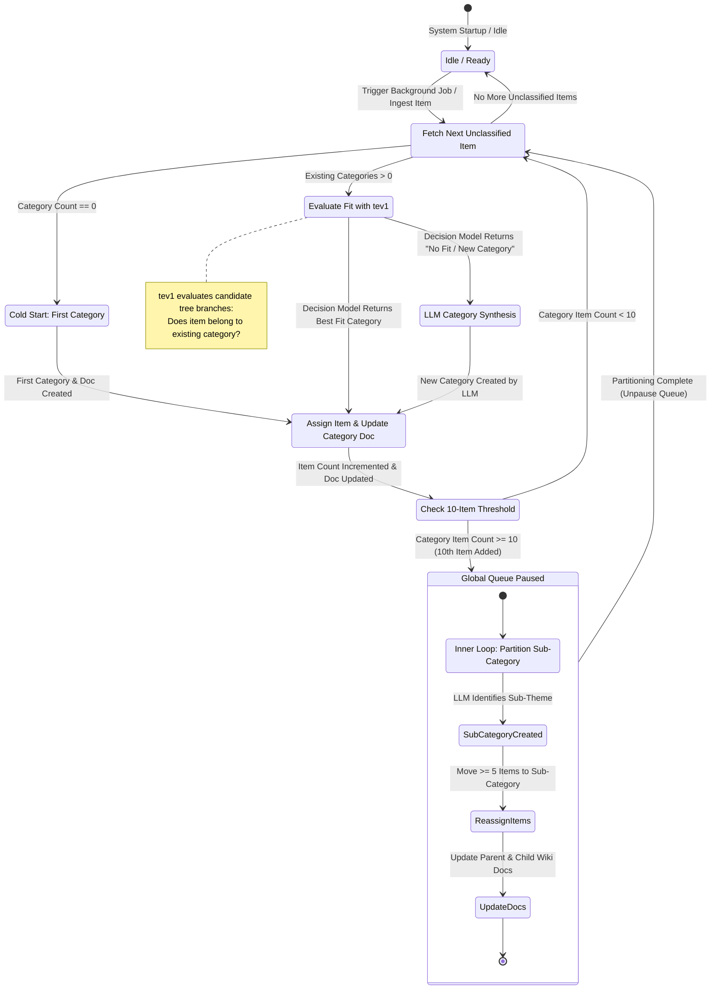

# Implementation Plan: Notes Processing, Autonomous Taxonomy State Machine & Agent Memory Message Board

## Context & Objectives

1. **Notes Processing Pipeline**:
   - Apply automated tagging, titling (if title is empty or generic), and link extraction (strictly filtered for valid web URLs `http://` / `https://`) to Notes (`Note`).
   - **Skip wiki generation** for notes (preserving the user's authentic note text without LLM rewriting).
2. **Autonomous Category Taxonomy State Machine**:
   - Completely independent from manual user collections (`Collection`).
   - Self-organizing hierarchical category taxonomy (`TaxonomyCategory`, `TaxonomyItem`).
   - **Cold Start**: Starts with 0 categories. The first item prompts the LLM to create Category #1 and its documentation (`doc`).
   - **Decision Gating (`tev1`)**: For subsequent items (articles, notes, videos, workspace snapshots), the decision model evaluates whether the item fits an existing category branch. If it fits, it is assigned and the category `doc` (category wiki) is updated. If not, the LLM creates a new category.
   - **Inner Partitioning Loop (10-Item Threshold)**:
     - Upon the 10th item being added to any category (or sub-category), the state machine enters `PAUSED_FOR_PARTITION`.
     - The LLM identifies a cohesive sub-theme and spawns a child sub-category.
     - At least half (>= 5) of the items are moved into the child sub-category.
     - Once the inner loop completes, global processing unpauses.
   - **Tree-Structured Classifier Input**:
     - When categories have sub-categories, they are structured and presented to the classifier as a tree.
   - **Continuous Pipeline**:
     - Can be run as a background crawler across existing database records or triggered incrementally when new items arrive.
3. **Agent Memory Message Board**:
   - Centralized persistent message board (`AgentMessage`) where all autonomous agents (Taxonomy State Machine, Workspace Coding Assistant, RAG Agent, Notes Ingestion) post and read messages, decisions, and system memory.
   - Agent memory tools: `post_agent_memory`, `read_agent_memory`.
   - UI viewer for monitoring multi-agent communications.

---

## State Machine Architecture & Workflow (Mermaid Diagram)



---

## Proposed Schema & Models (`src/kb_web/models_orm.py`)

### 1. `TaxonomyCategory`
- `id`: Integer primary key, autoincrement
- `name`: String (e.g., "PostgreSQL & Database Internals")
- `slug`: String unique index
- `parent_id`: Integer, ForeignKey("taxonomy_categories.id"), nullable (for tree hierarchy)
- `doc`: Text (the evolving category wiki documentation synthesized by LLM)
- `item_count`: Integer, default 0
- `depth`: Integer, default 0
- `created_at`: String (ISO timestamp)
- `updated_at`: String (ISO timestamp)
- `children`: relationship to self (`parent_id`)

### 2. `TaxonomyItem`
- `id`: Integer primary key, autoincrement
- `category_id`: Integer, ForeignKey("taxonomy_categories.id"), index=True
- `item_type`: String ("article", "note", "video", "workspace_snapshot")
- `item_id`: String (e.g. URL for articles/notes/videos, snapshot id for workspaces)
- `item_title`: String
- `fit_score`: Float (decision model confidence score)
- `assigned_at`: String (ISO timestamp)

### 3. `AgentMessage` (Agent Memory & Message Board)
- `id`: Integer primary key, autoincrement
- `agent_name`: String (e.g. "TaxonomyStateMachine", "WorkspaceAssistant", "RagAgent", "NotesIngestion")
- `channel`: String (e.g. "taxonomy", "workspaces", "notes", "system")
- `topic`: String
- `content`: Text
- `memory_type`: String ("decision", "state_transition", "milestone", "coordination")
- `metadata_json`: Text (structured JSON payload)
- `created_at`: String (ISO timestamp)

### 4. `Note` Model Enhancement
- Add `links`: Column(Text) — JSON-encoded array of extracted valid URLs (`https?://...`).

---

## State Machine Questions & Prompts Design

### Step 1: Decision Gating Fit Question (`tev1` via `ollama.systemone`)
- **State**: `item_title`, `item_excerpt`, and a formatted tree of existing categories with their short doc summaries.
- **Question**:
  ```python
  {
      "best_fit_category": {
          "type": "choice",
          "instructions": "Which category in the taxonomy tree does this item belong to conceptually, or should a new category be created?",
          "criteria": {
              "cat_<id>": "Detailed criteria matching category <id> domain and doc summary.",
              # ... for candidate categories ...
              "new_category": "The item introduces a distinct subject or domain that does not fit any existing category."
          }
      },
      "confidence": {
          "type": "noul",
          "instructions": "Is there strong thematic alignment with the selected category?",
          "criteria": {
              "true": "High conceptual overlap and relevance.",
              "false": "Marginal or poor fit."
          }
      }
  }
  ```

### Step 2: LLM New Category Synthesis (Prompt)
- If `new_category` is chosen or confidence is false:
  - System Prompt: Generates concise, professional category name, slug, and initial 2-3 paragraph `doc` (category wiki) explaining the category scope and why this item belongs in it.

### Step 3: Inner Loop (10-Item Partitioning)
- When `category.item_count >= 10`:
  - Fetch all items currently in category.
  - LLM prompts with all 10 item titles and excerpts.
  - LLM identifies a cohesive sub-theme that contains between 5 and 9 of the items.
  - Spawns child `TaxonomyCategory(parent_id=current_cat.id)`.
  - Re-links the matching `TaxonomyItem` records to the new child category ID.
  - Re-computes item counts for parent and child.
  - Updates parent `doc` and child `doc`.
  - Posts milestone event to `AgentMessage`.

---

## Agent Memory Tool Specification
- `post_agent_memory(agent_name, channel, topic, content, memory_type="decision", metadata=None)`
- `read_agent_memory(channel=None, memory_type=None, limit=20)`
- Required integration:
  - Taxonomy state machine posts state transitions, category creations, partition events.
  - Workspace coding agent consults and posts active tasks.
  - RAG report compiler checks memory for past research contexts.
