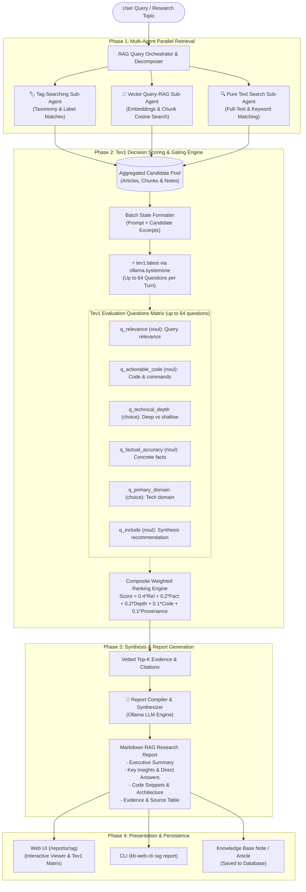

# Implementation Plan: Agentic RAG Report Generator & Elimination of File Chat

## Context & Objectives
1. **Eliminate "Chat with a File"**:
   - Retire the single-article chat drawer on `view_page.j2.html` and its associated `/api/conversations/chat` article coupling.
   - Replace the legacy `/conversations` navigation with **RAG Reports** (`/reports/rag`).
2. **Agentic RAG Report Generator**:
   - Build a multi-agent RAG research system that executes queries against the knowledge base.
   - Orchestrates 3 parallel retrieval sub-agents:
     - **Tag-Searching Sub-Agent**: queries taxonomy and associated tags.
     - **Vector Query-RAG Sub-Agent**: embeds queries/sub-queries and queries vector embeddings (`ChunkEmbedding` / pgvector).
     - **Pure Text Search Sub-Agent**: full-text/keyword search across titles, markdown content, and notes.
   - **Tev1 Decision Scoring Sub-Agent (up to 64 questions per turn)**:
     - Leverages native `ollama.systemone` with model `tev1` to evaluate candidate articles and chunks across structured criteria (relevance, actionable code, technical depth, factual density, domain alignment, etc.) using up to 64 questions per turn.
   - **Report Compiler Agent**:
     - Synthesizes top-ranked evidence into a rich, structured Markdown report with executive summary, answers, code snippets, and evidence citations.
   - **Web UI & CLI**:
     - Interactive web UI at `/reports/rag` with live sub-agent status, `tev1` decision scoring matrix, and rendered Markdown report viewer.
     - CLI command `kb-web-cli rag report "<query>"` with terminal streaming.

---

## Architectural Workflow (Mermaid Diagram)

---

## Detailed Implementation Slices

### Slice 1: Retire Single-Article Chat ("Chat with a File")
- **`src/kb_web/templates/view_page.j2.html`**:
  - Remove `<button onclick="openChatDrawer()">💬 Chat About Article</button>`.
  - Remove chat drawer backdrop, modal markup, and client JS (`openChatDrawer`, `closeChatDrawer`, `sendChatMessage`, etc.).
- **`src/kb_web/templates/base.j2.html` & `src/kb_web/templates/pages_list.j2.html`**:
  - Replace navigation links from `/conversations` to `/reports/rag` ("RAG Reports").
- **`src/kb_web/routers/conversations.py`**:
  - Add 301/302 redirect from `/conversations` to `/reports/rag`.
  - Deprecate `/api/conversations/chat` cleanly.

### Slice 2: Multi-Sub-Agent Retrieval & Tev1 Decision Scoring Engine
- **New File**: `src/kb_web/rag_agent.py`
  - `tag_search_subagent(session, query, limit=10)`:
    - Scans `FetchedPage.tags` and `Note.tags`.
    - Tokenizes query and identifies matching tags; loads articles/notes tagged with matching terms.
  - `vector_rag_subagent(session, client, query, active_model, limit=15)`:
    - Generates query embedding (`search_query: {query}`).
    - Searches `ChunkEmbedding` using pgvector or cosine similarity.
  - `text_search_subagent(session, query, limit=15)`:
    - Performs multi-keyword search across `FetchedPage` (title, description, md_content) and `Note` (title, content, wiki_summary).
  - `tev1_scoring_subagent(client, query, candidates, tev1_model="tev1")`:
    - Batches candidate items (or evaluates candidates) with native `client.systemone`.
    - Formulates up to 64 questions covering:
      - `relevance`: relevance to the specific research prompt.
      - `actionable_code`: presence of real code, config, or CLI examples.
      - `technical_depth`: deep architectural/implementation vs surface-level.
      - `factual_accuracy`: high signal density vs boilerplate.
      - `primary_domain`: classification into relevant engineering domain.
      - `include_in_report`: explicit gating recommendation.
    - Computes composite weighted scores and filters/ranks the top evidence.
  - `compile_rag_report(client, query, vetted_evidence, synthesis_model)`:
    - Formulates structured prompt with vetted candidate excerpts and citations.
    - Generates structured Markdown report.
    - Returns report markdown, structured metadata, and `tev1` evaluation table.

### Slice 3: REST API & Database Storage
- **`src/kb_web/models_orm.py`**:
  - Add `RagReport` model: `id`, `query`, `report_markdown`, `sources_json`, `tev1_evaluations_json`, `created_at`.
- **`src/kb_web/routers/rag_reports.py`**:
  - `POST /api/reports/rag/generate`: executes agentic RAG workflow and returns report + `tev1` decision data.
  - `GET /api/reports/rag`: lists saved RAG reports.
  - `GET /api/reports/rag/{id}`: retrieves report details.
  - `POST /api/reports/rag/{id}/save-to-notes`: exports the report as a Knowledge Base note (`Note`).
  - `DELETE /api/reports/rag/{id}`: deletes report.
  - `GET /reports/rag`: HTML interface.
- **`src/kb_web/server.py`**:
  - Mount `rag_reports.py` router.

### Slice 4: Modern Web UI (`/reports/rag`)
- **`src/kb_web/templates/rag_report.j2.html`**:
  - Hero query input form with model selection and research focus options.
  - Sub-agent execution cards:
    - 🏷️ Tag Searcher (found N tag matches)
    - 🧠 Vector RAG Searcher (found N chunk matches)
    - 🔍 Pure Text Searcher (found N text matches)
  - `tev1` Decision Gating Matrix:
    - Visual table showing each candidate, sub-agent origin, `tev1` relevance %, depth, actionable code badge, and inclusion verdict.
  - Markdown Report View:
    - Rendered HTML with syntax highlighting.
    - Action buttons: "Copy Markdown", "Download .md", "Save as KB Note".
  - Recent Reports Sidebar: quick browsing of past generated reports.

### Slice 5: CLI Subcommand (`kb-web-cli rag report`)
- **`kb-web-cli/src/kb_web_cli/main.py`**:
  - `rag_app = typer.Typer(name="rag")`
  - `kb-web-cli rag report "<query>" [--output report.md] [--model <model>]`
  - Real-time terminal output showing sub-agent retrieval counts, `tev1` scoring summary, and rendered report.

### Slice 6: Automated Testing & Verification
- **Unit Tests (`tests/test_rag_agent_and_reports.py`)**:
  - Test Tag-searching sub-agent.
  - Test Vector RAG sub-agent with mock embeddings.
  - Test Pure Text search sub-agent.
  - Test `tev1` decision scoring (verifying multi-question handling up to 64 questions and composite ranking).
  - Test Report compilation and REST endpoints.
  - Test CLI `rag report` command.
  - Test removal of article chat drawer and redirect from `/conversations`.
- Run `verify_ui_templates.py`.
- Run `uv run pytest`.
- Run `uv run python build.py`.
- Generate UAT testing artifact.
