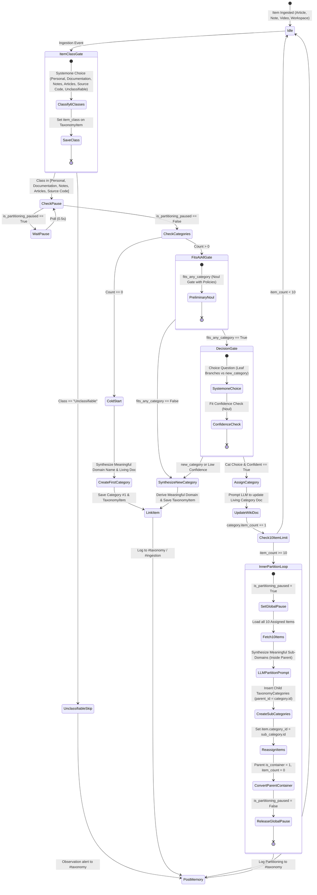

# Walkthrough: Autonomous Category Taxonomy State Machine, Notes Enrichment Pipeline, and Agent Memory Board

This walkthrough documents the design, implementation, and verification of the Autonomous Category Taxonomy State Machine, the Notes Ingestion Pipeline enhancements, and the Centralized Cross-Agent Memory Board.

---

## 1. Overview of Changes

### A. Notes Ingestion Pipeline
- **URL Filtering**: Added `extract_valid_urls(text)` in [`src/kb_web/utils.py`](file:///c:/src/kb-web/src/kb_web/utils.py) that strictly matches `http://` and `https://` web URLs, removing invalid schemes (`file:`, `mailto:`, `javascript:`), relative links, fragments (`#`), and trailing prose punctuation.
- **Automatic Titling**: Added `generate_note_title(content, config, client)` in [`src/kb_web/utils.py`](file:///c:/src/kb-web/src/kb_web/utils.py) to synthesize concise titles for untitled or blank notes.
- **Background Pipeline**: Updated `_process_note_in_background` in [`src/kb_web/routers/notes.py`](file:///c:/src/kb-web/src/kb_web/routers/notes.py) to apply titling, tagging, and link extraction (saved to `Note.links` and mirrored to `FetchedPage.links`), while explicitly **skipping AI wiki generation**.

### B. Autonomous Category Taxonomy State Machine
- **State Machine Core**: Implemented in [`src/kb_web/taxonomy_state_machine.py`](file:///c:/src/kb-web/src/kb_web/taxonomy_state_machine.py):
  - **Cold Start**: Starts with 0 categories. The inaugural incoming item prompts the LLM to create Category #1 with an authoritative living wiki doc.
  - **Top-Down Decision Gate**: Evaluates items against existing categories using `tev1` (`ollama.systemone`) with a top-down choice question across leaf branches or `new_category`, paired with a `fit_confidence` noul check.
  - **Living Category Wiki Docs**: Every category possesses a living `doc` wiki attribute updated and synthesized upon each new item assignment.
  - **10-Item Threshold & Inner Partitioning Loop**: When any category or sub-category reaches 10 items, global additions are paused (`is_partitioning_paused()`), and all 10 items are partitioned into 2 or more distinct child sub-categories. The parent becomes a pure group container (`is_container=1`, direct `item_count=0`). Once partitioned, global additions unpause.
  - **Tree Representation**: Hierarchical rendering for prompts (`format_category_tree_for_prompt`) and web visualization (`get_category_tree_data`).
  - **Background Crawler**: Traverses unclassified articles, notes, videos, and studio workspaces sequentially through the decision state machine (`crawl_and_classify_all`).
- **Web UI & REST API**: Added `/taxonomy` web browser ([`src/kb_web/templates/taxonomy.j2.html`](file:///c:/src/kb-web/src/kb_web/templates/taxonomy.j2.html)) and endpoints in [`src/kb_web/routers/taxonomy.py`](file:///c:/src/kb-web/src/kb_web/routers/taxonomy.py).

### C. Centralized Agent Memory & Message Board
- **Shared Memory Engine**: Implemented in [`src/kb_web/agent_memory.py`](file:///c:/src/kb-web/src/kb_web/agent_memory.py) backed by `AgentMessage` ORM model. Supports channels (`#taxonomy`, `#ingestion`, `#workspaces`, `#rag`) and structured memory types (`decision`, `observation`, `lifecycle`, `state_machine`, `artifact`).
- **Workspace Agent Tool**: Added `tool_post_memory` in [`src/kb_web/agent_tools.py`](file:///c:/src/kb-web/src/kb_web/agent_tools.py) and wired turn-by-turn memory logging into `workspace_agent.py`, `rag_agent.py`, `notes.py`, and `taxonomy_state_machine.py`.
- **Web UI & REST API**: Added `/agents/board` UI ([`src/kb_web/templates/agent_board.j2.html`](file:///c:/src/kb-web/src/kb_web/templates/agent_board.j2.html)) and endpoints in [`src/kb_web/routers/agent_board.py`](file:///c:/src/kb-web/src/kb_web/routers/agent_board.py).
- **Navigation Bar**: Added top-level links (`🗂️ Taxonomy` and `🧠 Board`) to [`src/kb_web/templates/base.j2.html`](file:///c:/src/kb-web/src/kb_web/templates/base.j2.html).

### D. CLI Subcommand Suites
- Added `kb-web-cli taxonomy crawl` (with `--limit`) and `kb-web-cli taxonomy tree` in [`src/kb_web/cli.py`](file:///c:/src/kb-web/src/kb_web/cli.py).
- Added `kb-web-cli board list` (with `--channel`, `--agent`, `--limit`) in [`src/kb_web/cli.py`](file:///c:/src/kb-web/src/kb_web/cli.py).
- Added `kb-web-cli db rollback` (with `--target`, `--revision`) in [`src/kb_web/cli.py`](file:///c:/src/kb-web/src/kb_web/cli.py).

### E. Hierarchical Notes Folder Tree (Resolves Nested Directory View)
- Added `build_nested_folder_tree(notes)` in [`src/kb_web/routers/notes.py`](file:///c:/src/kb-web/src/kb_web/routers/notes.py) to parse arbitrary slash-delimited paths into structured, recursive dictionary trees.
- Enhanced `/api/notes/tree` to supply both `nested_tree` (recursive) and legacy `tree` (flat).
- Implemented recursive macro `render_folder_node` in [`src/kb_web/templates/notes_list.j2.html`](file:///c:/src/kb-web/src/kb_web/templates/notes_list.j2.html) featuring collapsible `<details open>` chevrons, folder icons, note count badges, and indented child hierarchy.

### F. Prior 6-Class Item Classification Gate & State Policy Directives
- Implemented `classify_item_class()` in [`src/kb_web/taxonomy_state_machine.py`](file:///c:/src/kb-web/src/kb_web/taxonomy_state_machine.py) gating items into 6 canonical classes: `Personal`, `Documentation`, `Notes`, `Articles`, `Source Code`, `Unclassifiable`.
- Embedded structured `policies: [...]` arrays in the decision state dict governing classification.
- Unclassifiable items post observation alerts to `#taxonomy` on the Agent Message Board and bypass domain classification.
- Added `item_class` column to `TaxonomyItem` ORM model.

### G. Preliminary "Fits at All" Decision Gate (`fits_any_category`)
- Added preliminary `noul` gate question `fits_any_category` to `evaluate_category_fit_tev1()` with explicit policy directives before evaluating candidate category fit.
- Directly synthesizes a new domain if an item does not fit existing categories at all.

### H. Meaningful Domain Naming & Sub-Category Containment
- Implemented `_is_generic_domain_name()` and `_derive_meaningful_domain_name()` in [`src/kb_web/taxonomy_state_machine.py`](file:///c:/src/kb-web/src/kb_web/taxonomy_state_machine.py) enforcing descriptive semantic domain names and rejecting generic numbered labels (`Domain 10`, `Category 3`).
- Pinned sub-categories during 10-item partitioning inside the parent domain (`parent_id = category.id`), keeping reclassifications strictly inside the original chosen domain.

### I. Database Migration & Rollback Pipeline
- Created migration `migrations/versions/f92d84291a25_add_taxonomy_classification.py`.
- Added `rollback()` and `rollback_single()` in [`src/kb_web/scripts/deploy_migrations.py`](file:///c:/src/kb-web/src/kb_web/scripts/deploy_migrations.py).
- Successfully executed rollback to purge old test data, followed by clean migration upgrade to head.

---

## 2. Mermaid State Transition Diagram



---

## 3. Verification & Test Evidence

### A. Test Suite Results
- Automated pre-commit verification run:
  ```bash
  uv run pytest
  ```
  Result: **132 passed, 0 failures** across all test suites including:
  - `tests/test_taxonomy_and_agent_memory.py`: 16 passed (URL filtering, note titling, wiki skipping, agent memory, cold start, decision gate, 10-item partitioning loop, CLI, hierarchical notes tree, 6-class gate, fits-at-all gate, meaningful domain naming, and sub-category containment).
  - `tests/test_sprint6_features.py`: 13 passed (RAG semantic search, model comparison, notes, and workspaces).
  - `tests/test_cli_auth_and_workspaces.py`: 7 passed.
  - `tests/test_server.py`, `tests/test_rest_api.py`, `tests/test_security_hardening.py`, `tests/test_crawler.py`, `tests/test_db_cli.py`, `tests/test_qdrant_sync.py`: all passed.

### B. UI Component Check
- Executed `verify_ui_templates.py`:
  ```bash
  uv run python .agents/skills/ui-component-uat-check/scripts/verify_ui_templates.py
  ```
  Result: **24 templates checked, 0 warnings**.

### C. Build Pipeline Verification
- Executed `build.py`:
  ```bash
  uv run python build.py
  ```
  Result: **Successfully compiled wheels and source distributions for `kb_web` and `kb_web_cli`**.

### D. VCS UAT Testing Artifacts
- Standardized VCS reports generated in `uat/`:
  - Log: `uat/logs/test_log_taxonomy-state-machine-agent-memory_*.log`
  - Report: `uat/reports/uat_report_taxonomy-state-machine-agent-memory_*.md`
