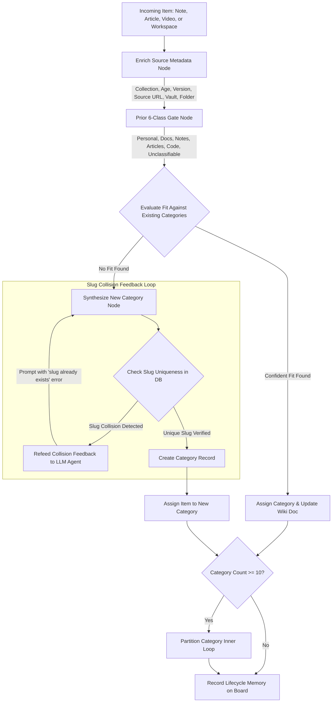

# Implementation Plan: Workspace UX, Notes Cascade Deletion, and Taxonomy Graph Harness

## Overview
This plan implements 9 key usability and architectural improvements across `kb-web`:
1. **Notes Cascading Deletion**: Resolves foreign key constraint errors by comprehensively purging all dependent records across chat, embeddings, taxonomy, collections, and mirrored pages before note removal.
2. **Workspace README Formatting & Markdown Preview**: Fixes template syntax and introduces live rendered Markdown previews for documents and gists.
3. **AI Prompt-Driven Workspace Creation**: Allows creating complete workspaces from an initial user prompt.
4. **Flexible Project Types & Gist Mode**: Removes the 3-template limitation to allow arbitrary project types and lightweight multi-file code gists.
5. **Real-time Ollama Loaded Models Display**: Introspects `/api/ps` to highlight models currently loaded in VRAM (`🟢 Loaded in VRAM`) across all model pickers.
6. **Targeted Notes Re-Taxonomy Classification**: Adds dedicated endpoints and UI triggers to run taxonomy classification on unclassified notes.
7. **Workspace Hierarchical Folders & Drag-and-Drop**: Replaces flat `.keep` string rows with a true collapsible tree with folder icons and drag-and-drop file reorganization.
8. **Taxonomy Slug Collision Retry Loop & Graph Harness**: Re-feeds duplicate slug errors back to the LLM in an agent loop to select distinct domains or merge paths.
9. **Taxonomy Source Metadata Enrichment**: Injects collection, age, version, source URL, and folder hierarchy into taxonomy state machine decision prompts.

---

## Architecture & Process Loops

### Taxonomy Agent Graph Harness Loop

---

## Proposed Changes

### 1. Database & Cascading Deletion (`models_orm.py`, `routers/notes.py`, `routers/admin_batch.py`)
- Define `_cascade_delete_notes(session, note_ids=None, urls=None)`:
  - Cascades `ChatConversation` & `ChatMessage` where `source_id == note.url` or `source_id == str(note.id)`.
  - Cascades `ChunkEmbedding` where `source_id == note.url`.
  - Cascades `TaxonomyItem` where `item_id in (note.url, str(note.id), f"note_{note.id}")`.
  - Cascades `CollectionItem` & `CollectionAction` where `source_id == note.url`.
  - Cascades `ArticleEmbedding`, `TitleEmbedding`, `VideoEmbedding`, `PageVersion`, `Link` where `url == note.url`.
  - Cascades `FetchedPage` where `url == note.url`.
  - Deletes `Note` records.
- Add `DELETE /api/notes/{note_id}` for single note deletion.
- Update `DELETE /api/notes/batch` to use `_cascade_delete_notes`.

### 2. Workspace Backend & Generation (`models.py`, `routers/workspaces.py`)
- Extend `WorkspaceCreateRequest` with `prompt: Optional[str] = None`.
- Support arbitrary `template` / project type strings (e.g. `gist`, `react`, `rust`, `markdown`, etc.) without defaulting back to `web-game`.
- Implement AI workspace generation in `POST /api/workspaces`:
  - When `prompt` is provided, call Ollama with system instructions to design the workspace, generate the file manifest, and write initial code and clean `README.md`.
- Improve starter `README.md` template strings with clean formatting and no extra indentation.

### 3. Workspace IDE UI (`workspace_ide.j2.html`, `workspaces_list.j2.html`)
- **Folder Tree & Drag-and-Drop**:
  - Refactor `refreshFileTree()` to build a nested hierarchy from file paths.
  - Render folder rows with `📁` icon and collapsible chevron.
  - Hide raw `.keep` files while preserving the parent folder.
  - Implement HTML5 drag-and-drop (`draggable="true"`, `ondragstart`, `ondragover`, `ondrop`) to move files between folders.
- **Markdown Document Preview**:
  - In `runCurrentProject()`, if the active file is a `.md` file, render beautiful formatted markdown using `marked.parse()` with Github styling in the preview panel.
- **Create Modal Updates**:
  - Add "AI Prompt Generation" input field in `workspaces_list.j2.html`.
  - Add custom project type input / flexible selection.

### 4. Ollama Real-time Loaded Models (`routers/workspaces.py`, UI templates)
- Add or enhance `GET /api/workspaces/models`:
  - Query `/api/ps` to identify models currently loaded into memory/VRAM.
  - Query `/api/tags` for installed models.
  - Return `{ "models": [...], "loaded_models": [...], "default_model": "..." }`.
- Update model selector dropdowns across `workspace_ide.j2.html`, `admin.j2.html`, `rag_report.j2.html`, and `conversations_list.j2.html`:
  - Add visual `🟢 (Loaded in VRAM)` indicator and group loaded models at the top.

### 5. Targeted Notes Taxonomy Classification (`routers/taxonomy.py`, `taxonomy_state_machine.py`)
- Add `POST /api/taxonomy/classify-notes` endpoint:
  - Accepts `vault: Optional[str]`, `force_reclassify: bool = False`, `limit: int = 100`.
  - Filters unclassified notes (or purges note taxonomy items if `force_reclassify=True`) and processes them in a background worker.
- Add UI triggers in `notes_list.j2.html` ("🏷️ Classify Notes") and `taxonomy.j2.html`.

### 6. Taxonomy Slug Collision Loop & Source Metadata Enrichment (`taxonomy_state_machine.py`)
- **Source Metadata Enrichment**:
  - Update `classify_single_item`:
    - Articles/Videos: Ingest `collection_title`, `age` (`fetched_at`), `version_count`, `source_url`.
    - Notes: Ingest `vault_name`, `folder_path`, `syntax`, `created_at`.
    - Workspaces: Ingest `template`, `files_count`, `created_at`.
  - Inject these metadata keys directly into `state` dict passed to `classify_item_class` and `evaluate_category_fit_tev1`.
- **Slug Collision Catch Loop**:
  - Check slug uniqueness before committing new categories in `_synthesize_new_category` and `partition_category`.
  - If slug exists, catch and re-prompt the LLM agent up to 3 turns with error feedback:
    `"Error: A category with slug '{slug}' already exists. Please choose a distinct, more specific domain name or indicate if it should merge into '{existing_name}'."`
  - Add `_ensure_unique_slug(session, base_slug)` helper as a fallback.

---

## Verification Plan

### Automated Testing
1. **Notes Cascading Deletion Tests**:
   - Create a note with linked `FetchedPage`, `ChunkEmbedding`, `TaxonomyItem`, and `ChatConversation`.
   - Delete note via `DELETE /api/notes/{id}` and `DELETE /api/notes/batch`.
   - Verify all dependent rows are deleted without foreign key violations.
2. **Workspace Generation & Custom Types Tests**:
   - Test workspace creation with custom type `gist` and `prompt`.
   - Verify file generation and language detection.
3. **Ollama Loaded Models Introspection Tests**:
   - Test `GET /api/workspaces/models` returns `loaded_models` and `models`.
4. **Targeted Notes Taxonomy Classification Tests**:
   - Test `POST /api/taxonomy/classify-notes`.
5. **Taxonomy Slug Collision Retry Tests**:
   - Test slug collision detection, feedback loop, and unique slug generation.
6. **Full Test Suite & Pre-Commit**:
   - `uv run pytest` (all tests passing).
   - `python .agents/skills/ui-component-uat-check/scripts/verify_ui_templates.py` (0 warnings).
   - `uv run python build.py`.

### Manual / Browser Verification
- Open Workspace IDE: Verify folder collapse/expand and drag-and-drop file organization.
- Test Markdown file preview in Workspace IDE.
- Inspect model selector dropdowns to verify `🟢 Loaded in VRAM` badge.
- Test "Classify Notes" action in Notes view.
