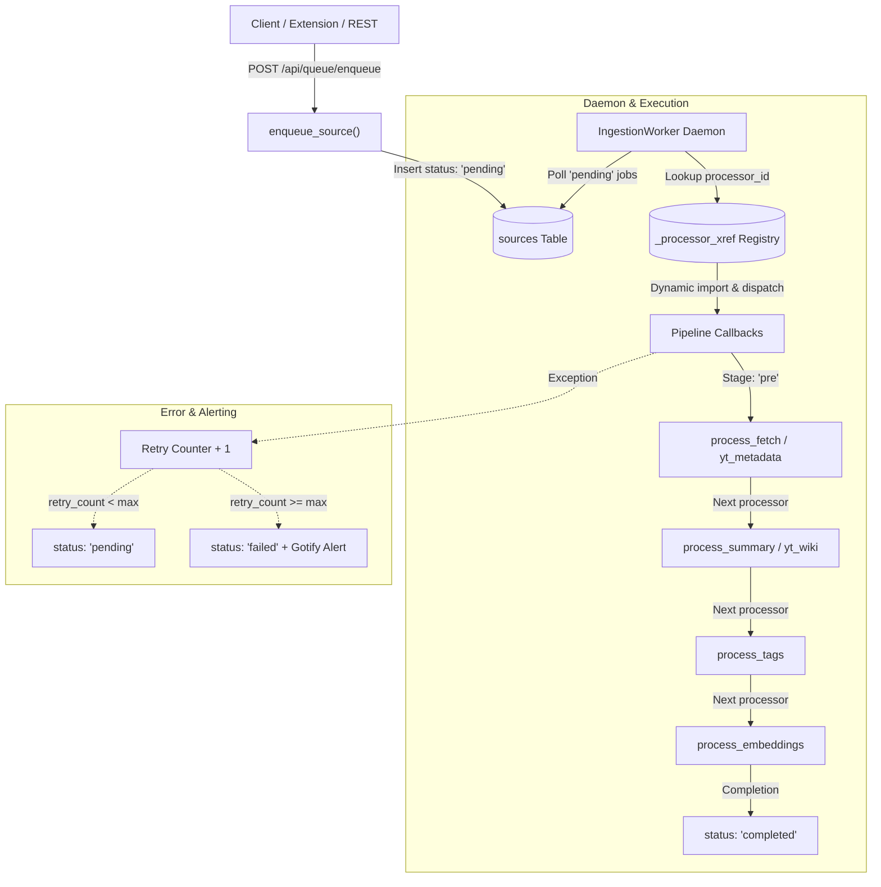
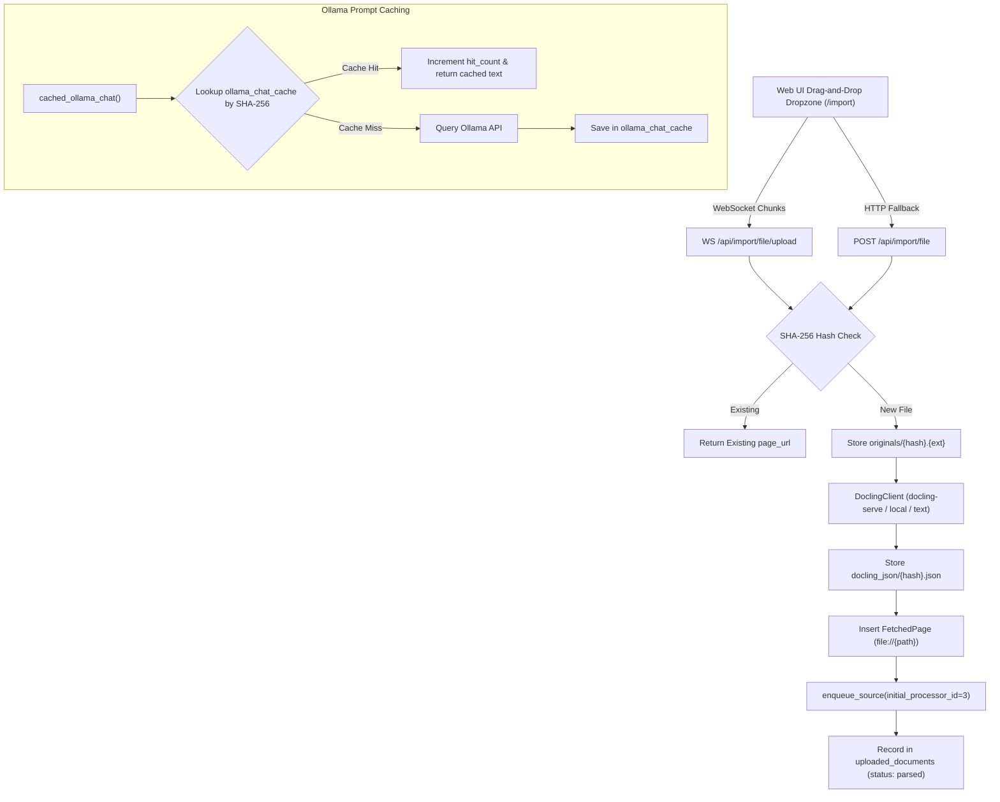

# Walkthrough: Sprint 4 Unified Ingestion Sources Schema & Queue Processor

Encompassing:
- **Parent Issue #48**: Sprint 4: Unified Ingestion Sources Schema & Queue Processor
- **Sub-Issue 8 (#49)**: Top-Level Ingestion Sources & Processing Registry Schema
- **Sub-Issue 9 (#50)**: State-Driven Job Queue Processor Daemon

---

## 1. Summary of Changes

In Sprint 4, we transformed the monolithic, linear URL/file ingestion into an extensible, state-driven background job queue architecture driven by a unified `sources` queue and `_processor_xref` pipeline registry.

### Core Architecture Components:

---

## 2. Key Code Artifacts & Deliverables

### A. ORM Models & Migrations (`src/kb_web/models_orm.py`, `migrations/versions/e81c74291a24_add_sources_and_processor_xref.py`)
1. **`ProcessorXref` (`_processor_xref`)**:
   - `id`: Auto-incrementing primary key.
   - `service_name`: Unique name of the processor service.
   - `callback_path`: Dynamic module:callable resolution path (e.g. `kb_web.queue_processor:process_fetch`).
   - `stage`: Pipeline stage (`pre`, `process`, `post`).
   - `next_processor_id`: Self-referential foreign key defining sequential chaining.
   - `is_active`: Boolean active flag.
   - `description`: Textual documentation for the processor.
2. **`Source` (`sources`)**:
   - `id`: UUID (36-char string) primary key.
   - `url`: Optional target URL.
   - `file_hash`: Hash of the raw/markdown content.
   - `type`: Source format (`html`, `youtube`, `file`, `docling`).
   - `processor_id`: Foreign key to `_processor_xref.id`.
   - `path`: Optional local filesystem path.
   - `status`: State tracking (`pending`, `processing`, `completed`, `failed`).
   - `retry_count`: Incremental failure counter.
   - `error_log`: Traceback logs of errors encountered.
   - `timestamp`: ISO-8601 creation timestamp.
   - `metadata_json`: Extensible JSON payload (e.g. collection IDs, custom AI instructions).
3. **Child Foreign Key Linkage**:
   - Added `source_id` to `FetchedPage` and `YouTubeVideo`.
   - Added `source_uuid` to `ChunkEmbedding`.
4. **Automated Seeding & Sequence Sync**:
   - Pre-seeds default pipeline processors (`fetcher` -> `wiki_summary` -> `tagger` -> `embeddings`, `youtube_metadata` -> `youtube_wiki`, `docling_parser`).
   - Synchronizes PostgreSQL autoincrement sequence `_processor_xref_id_seq` to prevent duplicate primary key conflicts during tests and runtime.

---

### B. Queue Processor Daemon (`src/kb_web/queue_processor.py`)
1. **`IngestionWorker` Daemon**:
   - Configurable polling daemon running in background thread with clean `start()`, `stop()`, and `is_running` lifecycle.
   - `process_next_job(source_id=None)`: Safely acquires next pending job, executes assigned processor callback, advances `processor_id` to next stage or marks `completed`.
   - Retry management: increments `retry_count` and records full tracebacks in `error_log`; transitions to `failed` and triggers Gotify error notifications when `retry_count >= max_retries`.
2. **Dynamic Callback Resolver (`resolve_callback`)**:
   - Safely resolves string callback targets in module:func format with caching.
3. **Built-in Callback Handlers**:
   - `process_fetch`: Extracts HTML and converts to markdown.
   - `process_summary`: Queries Ollama LLM for structured wiki digestion.
   - `process_tags`: Queries Ollama LLM for semantic tag categorization.
   - `process_embeddings`: Computes vector embeddings and saves chunk embeddings mapped to `source_uuid`.
   - `process_youtube_metadata`: Extracts video metadata and transcript via `yt-dlp`.
   - `process_youtube_wiki`: Generates wiki digest from video transcript.
   - `process_docling_file`: Converts document files into markdown.
4. **Lifecycle Hooks in `src/kb_web/server.py`**:
   - FastAPI `lifespan` context manager automatically starts `IngestionWorker` on server boot and stops it cleanly on shutdown.

---

### C. REST API Endpoints (`src/kb_web/routers/rest_api.py`)
- `GET /api/queue/jobs`: Paginated listing of queue jobs, including processor names, stages, statuses, retry counts, and errors.
- `POST /api/queue/enqueue`: Programmatic job submission endpoint returning queued status and source ID.

---

## 3. Verification & Testing

### Automated Test Results:
- **`tests/test_queue_processor.py`**: 7/7 passed.
  - `test_default_processors_seeded`: Verifies pipeline chains and stages.
  - `test_resolve_callback`: Tests resolution of callable references.
  - `test_enqueue_source_defaults`: Verifies default processor assignment for HTML, YouTube, and files.
  - `test_worker_pipeline_progression`: Tests sequential step-by-step state progression.
  - `test_worker_retry_and_failure`: Tests retry counter increment and terminal `failed` marking on max retries.
  - `test_worker_thread_lifecycle`: Tests daemon thread start and stop.
  - `test_rest_api_queue_endpoints`: Tests `/api/queue/enqueue` and `/api/queue/jobs`.

---

# Walkthrough: Sprint 5 WebSocket Ingestion, Docling Integration, & Cache Settings

Encompassing:
- **Parent Issue #51**: Sprint 5: WebSocket Ingestion, Docling Integration, & Cache Settings
- **Sub-Issue 10 (#52)**: WebSocket File Ingestion & Drag-and-Drop Ingestion UI
- **Sub-Issue 11 (#53)**: Standalone Ollama Chat Caching, Prompts Logs, & Settings Management
- **Issue #36**: Add `docling-serve` Support and File Imports

---

## 1. Summary of Changes

Sprint 5 completes the multimodal document ingestion pipeline by introducing real-time chunked streaming document uploads via WebSockets, deep document parsing via IBM Docling (`docling-serve` HTTP microservice with OCR and local fallbacks), deduplicated document artifact storage, automated 7-day upload cleanup, deterministic Ollama prompt response caching with hit tracking, and complete admin configuration management.

### Architecture Overview:

---

## 2. Key Code Artifacts & Deliverables

### A. Database Models & Alembic Migration
1. **`UploadedDocument` (`uploaded_documents`)**:
   - `file_hash`: Primary key (SHA-256 hex string).
   - `filename`, `file_size`, `mime_type`, `file_path`.
   - `docling_json_path`: Path to parsed Docling JSON artifact.
   - `status`: `uploaded`, `parsed`, `failed`, `purged`.
   - `error_message`: Traceback or conversion failure detail.
   - `uploaded_at`: ISO timestamp.
   - `source_id`: Foreign key link to `sources.id`.
2. **`OllamaChatCache` (`ollama_chat_cache`)**:
   - `prompt_hash`: Primary key (SHA-256 hex string computed deterministically from `model:settings_json:prompt_str`).
   - `model_used`: Model identifier string (e.g. `gemma4:latest`).
   - `prompt_text`: Raw prompt string or serialized message array.
   - `response_text`: Cached output string from LLM.
   - `settings_json`: Serialized options/parameters (`temperature`, `top_p`, `think`).
   - `hit_count`: Integer access and cache hit counter.
   - `created_at`, `last_accessed_at`: ISO timestamps.
3. **Migration `f92d84291a25_add_ollama_cache_and_uploads.py`**:
   - Creates `uploaded_documents` and `ollama_chat_cache` tables with indexes.

---

### B. Uploads Router & WebSocket Streaming (`src/kb_web/routers/uploads.py`)
- **WebSocket Endpoint (`/api/import/file/upload`)**:
  - Handles client handshake with file metadata (`start`).
  - Streams binary chunks with real-time transfer progress updates.
  - Concludes upon `"EOF"` or `{"type": "done"}`.
  - Invokes `_process_uploaded_file()` with Docling conversion.
- **HTTP Endpoint (`/api/import/file`)**:
  - Multipart file upload fallback supporting `custom_instructions` and target `collection_id`.
- **Deduplication & Pipeline Queue**:
  - SHA-256 content hashing: saves original to `~/.kb/uploads/originals/{hash}.{ext}`.
  - Saves parsed Docling JSON to `~/.kb/uploads/docling_json/{hash}.json`.
  - Creates `FetchedPage` record with `file://{permanent_original}` URL.
  - Dispatches `enqueue_source(initial_processor_id=3)` to jump straight to tagging and embedding since document text is already extracted.
- **Purge Routine (`purge_expired_uploads`)**:
  - Automatically deletes uncompleted or failed uploads older than 7 days from disk and database.

---

### C. Docling Client (`src/kb_web/utils.py`)
- **`DoclingClient`**:
  - Connects to remote or local `docling-serve` service via HTTP.
  - `is_alive()` endpoint validation.
  - Passes OCR configuration (`ocr=True/False`) based on server configuration.
  - Falls back to local `docling.document_converter` package if available.
  - Falls back to plain-text / UTF-8 decoders for markdown, text, or csv files.
  - Supported formats: `.pdf`, `.docx`, `.pptx`, `.xlsx`, `.html`, `.asciidoc`, `.md`, `.csv`.

---

### D. UI Enhancements (`url_import.j2.html`, `admin.j2.html`)
- **Document Upload Tab on `/import`**:
  - Tab 3 "📁 Document Upload (Docling)".
  - Interactive dropzone with drag-over styling and format badges.
  - Live progress bar, upload speed calculation (KB/s), and real-time status messaging.
- **Admin Configuration & Prompt Cache on `/admin`**:
  - Docling Service URL and OCR toggle inputs with live "Test Connection" button.
  - Advanced Ollama parameters: `temperature` and `top_p`.
  - Ollama Prompt Cache management table with live search filtering, entry previews, hit counts, and clear cache trigger (`POST /admin/ollama/cache/clear`).

---

## 3. Verification & Testing

### Automated Test Suite:
- **`tests/test_sprint_5_docling_ollama.py`**: 12/12 passed (100%).
  - `test_docling_supported_extensions`: Validates allowed extensions and rejection of invalid types.
  - `test_docling_client_is_alive`: Verifies healthcheck endpoints.
  - `test_docling_convert_via_serve`: Tests mock HTTP API conversion via docling-serve.
  - `test_docling_fallback_plain_text`: Tests markdown and text fallback extraction.
  - `test_cached_ollama_chat_hit_and_miss`: Tests cache key generation, hit increments, and avoiding duplicate LLM calls.
  - `test_purge_expired_uploads`: Tests 7-day retention policy and automated disk cleanup.
  - `test_admin_docling_and_ollama_settings`: Tests persistence of Docling URL, OCR, temperature, and top-p in SQLite and PostgreSQL.
  - `test_admin_test_docling_endpoint`: Tests administrative healthcheck endpoint.
  - `test_admin_ollama_cache_management`: Tests cache listing and clearing.
  - `test_http_multipart_file_upload`: Tests multipart upload and queue integration.
  - `test_http_file_upload_blacklisted_extension`: Verifies rejection of `.exe` and `.sh`.
  - `test_websocket_chunked_file_upload`: Tests live streaming chunked upload over WebSockets.
- **Full Repository Suite (`uv run pytest`)**: 95/95 passed (100%).
- **Build Pipeline (`uv run python build.py`)**: Succeeded cleanly; wheel distributions created.
- **UI Component Checks (`verify_ui_templates.py`)**: 14/14 HTML templates validated with 0 warnings.
- **VCS UAT Report**: Generated in `uat/reports/uat_report_sprint_5_websocket_docling_cache_20260914_003133.md`.

---

## 4. Sprint Tracker Status

Sprint 5 is fully implemented, verified, and complete. All deliverables for issues #51, #36, #52, and #53 are satisfied.
