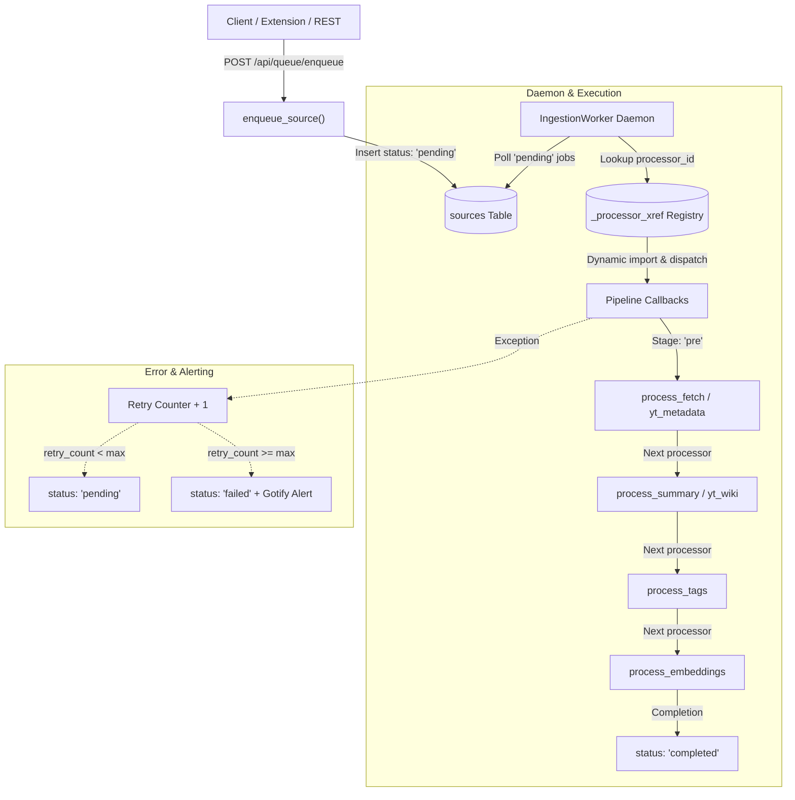

# Walkthrough: Sprint 4 Unified Ingestion Sources Schema & Queue Processor

Encompassing:
- **Parent Issue #48**: Sprint 4: Unified Ingestion Sources Schema & Queue Processor
- **Sub-Issue 8 (#49)**: Top-Level Ingestion Sources & Processing Registry Schema
- **Sub-Issue 9 (#50)**: State-Driven Job Queue Processor Daemon

---

## 1. Summary of Changes

In Sprint 4, we transformed the monolithic, linear URL/file ingestion into an extensible, state-driven background job queue architecture driven by a unified `sources` queue and `_processor_xref` pipeline registry.

### Core Architecture Components:

---

## 2. Key Code Artifacts & Deliverables

### A. ORM Models & Migrations (`src/kb_web/models_orm.py`, `migrations/versions/e81c74291a24_add_sources_and_processor_xref.py`)
1. **`ProcessorXref` (`_processor_xref`)**:
   - `id`: Auto-incrementing primary key.
   - `service_name`: Unique name of the processor service.
   - `callback_path`: Dynamic module:callable resolution path (e.g. `kb_web.queue_processor:process_fetch`).
   - `stage`: Pipeline stage (`pre`, `process`, `post`).
   - `next_processor_id`: Self-referential foreign key defining sequential chaining.
   - `is_active`: Boolean active flag.
   - `description`: Textual documentation for the processor.
2. **`Source` (`sources`)**:
   - `id`: UUID (36-char string) primary key.
   - `url`: Optional target URL.
   - `file_hash`: Hash of the raw/markdown content.
   - `type`: Source format (`html`, `youtube`, `file`, `docling`).
   - `processor_id`: Foreign key to `_processor_xref.id`.
   - `path`: Optional local filesystem path.
   - `status`: State tracking (`pending`, `processing`, `completed`, `failed`).
   - `retry_count`: Incremental failure counter.
   - `error_log`: Traceback logs of errors encountered.
   - `timestamp`: ISO-8601 creation timestamp.
   - `metadata_json`: Extensible JSON payload (e.g. collection IDs, custom AI instructions).
3. **Child Foreign Key Linkage**:
   - Added `source_id` to `FetchedPage` and `YouTubeVideo`.
   - Added `source_uuid` to `ChunkEmbedding`.
4. **Automated Seeding & Sequence Sync**:
   - Pre-seeds default pipeline processors (`fetcher` -> `wiki_summary` -> `tagger` -> `embeddings`, `youtube_metadata` -> `youtube_wiki`, `docling_parser`).
   - Synchronizes PostgreSQL autoincrement sequence `_processor_xref_id_seq` to prevent duplicate primary key conflicts during tests and runtime.

---

### B. Queue Processor Daemon (`src/kb_web/queue_processor.py`)
1. **`IngestionWorker` Daemon**:
   - Configurable polling daemon running in background thread with clean `start()`, `stop()`, and `is_running` lifecycle.
   - `process_next_job(source_id=None)`: Safely acquires next pending job, executes assigned processor callback, advances `processor_id` to next stage or marks `completed`.
   - Retry management: increments `retry_count` and records full tracebacks in `error_log`; transitions to `failed` and triggers Gotify error notifications when `retry_count >= max_retries`.
2. **Dynamic Callback Resolver (`resolve_callback`)**:
   - Safely resolves string callback targets in module:func format with caching.
3. **Built-in Callback Handlers**:
   - `process_fetch`: Extracts HTML and converts to markdown.
   - `process_summary`: Queries Ollama LLM for structured wiki digestion.
   - `process_tags`: Queries Ollama LLM for semantic tag categorization.
   - `process_embeddings`: Computes vector embeddings and saves chunk embeddings mapped to `source_uuid`.
   - `process_youtube_metadata`: Extracts video metadata and transcript via `yt-dlp`.
   - `process_youtube_wiki`: Generates wiki digest from video transcript.
   - `process_docling_file`: Converts document files into markdown.
4. **Lifecycle Hooks in `src/kb_web/server.py`**:
   - FastAPI `lifespan` context manager automatically starts `IngestionWorker` on server boot and stops it cleanly on shutdown.

---

### C. REST API Endpoints (`src/kb_web/routers/rest_api.py`)
- `GET /api/queue/jobs`: Paginated listing of queue jobs, including processor names, stages, statuses, retry counts, and errors.
- `POST /api/queue/enqueue`: Programmatic job submission endpoint returning queued status and source ID.

---

## 3. Verification & Testing

### Automated Test Results:
- **`tests/test_queue_processor.py`**: 7/7 passed.
  - `test_default_processors_seeded`: Verifies pipeline chains and stages.
  - `test_resolve_callback`: Tests resolution of callable references.
  - `test_enqueue_source_defaults`: Verifies default processor assignment for HTML, YouTube, and files.
  - `test_worker_pipeline_progression`: Tests sequential step-by-step state progression.
  - `test_worker_retry_and_failure`: Tests retry counter increment and terminal `failed` marking on max retries.
  - `test_worker_thread_lifecycle`: Tests daemon thread start and stop.
  - `test_rest_api_queue_endpoints`: Tests `/api/queue/enqueue` and `/api/queue/jobs`.

---

## 4. Sprint Tracker Status

Sprint 4 is complete and checked off in `.artifacts/analysis-issues-29-30/sprint_tracker.md` and `sprint_4_job_queue.md`.
Ready to proceed to **Sprint 5** (Issue #51: WebSocket Ingestion, Docling, & Cache Settings).
