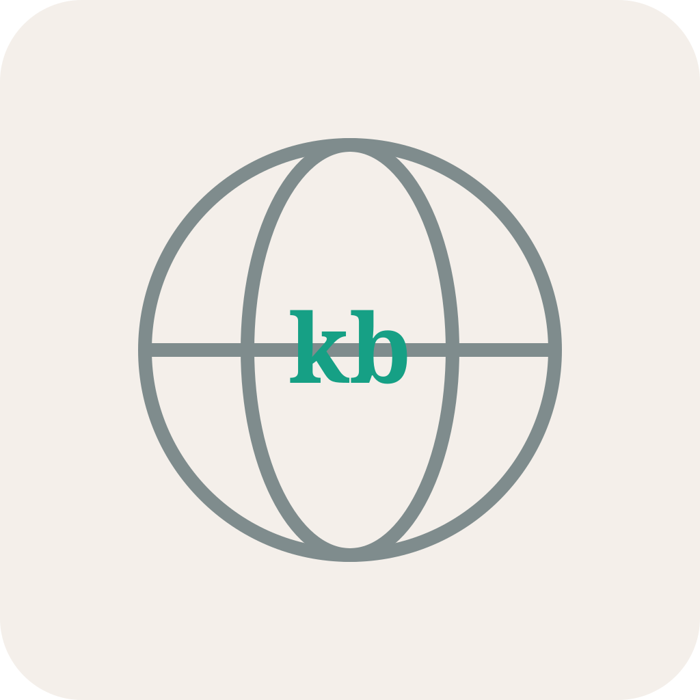

#  kb-web

A standalone web application and CLI wrapper for the Knowledge Base (kb) ecosystem. It provides a FastAPI web portal for capturing and importing web pages, cleaning them using Ollama LLM agents, searching the archive, and streaming database exports.

## Core Features

- **PWA Web Ingestion Target**: Registers as a share target on mobile and desktop web browsers, enabling quick clicks to ingest URLs directly.
- **Chrome Browser Extension Ingest**: Features an unpackaged Chrome extension targeting `/api/import/html` to instantly post raw tab HTML, bypassing authentication and JavaScript obstacles.
- **AI Wiki Conversion**: Rewrites raw scraped web pages into clean, highly structured markdown wiki entries starting with H1 titles `# Title` using Ollama.
- **Tag Curation & Editing**: Automates tag generation through Ollama classification prompts and allows manual tag updates inside the UI.
- **Root Chronological Archive Feed**: Hitting `/` directly renders the public ingestion feed, omitting any login restrictions.
- **Source Page Re-fetching with Version Snapshots**: Re-fetches the page URL. If successful, archives the current copy in `page_versions` and updates the latest page with the newly ingested content; otherwise, rolls back and retains the original page.
- **Secure Password Manager**: Allows logged-in administrators to change the passcode after verifying current credentials from the web UI.
- **Interactive Action Triggers**: Supports 1-click Wiki, Tag, and source URL re-fetching / re-generation directly on the page view profile.
- **Administrative Settings Portal**: Prefills and updates Ollama hosts/models, system prompts, API keys, and Gotify details directly from the Web UI.
- **Chunked WS Ingest**: Supports uploading JSON database backups over WebSockets.
- **JSON Streams**: Streams database records out as downloadable files.

---

## Codebase Structure

- `src/kb_web/config.py`: Configuration class extending the base `kb_core` configuration to support LLM, API keys, and web UI variables.
- `src/kb_web/db.py`: Database helper setting up and migrating `title` and `tags` columns in the shared SQLite database.
- `src/kb_web/models.py`: Pydantic validation schemas (`ParsedUrl` and `HTMLPage`) representing stored pages.
- `src/kb_web/server.py`: FastAPI application routing, route guards, and background tasks.
- `src/kb_web/cli.py`: Typer command launcher.
- `src/kb_web/templates/`: Jinja2 templates for login, dashboard lists, configuration inputs, and profile views.
- `browser_extension/`: Source directory containing manifest, options menu, and background worker for Chrome imports.
- `kb-web.service`: Systemd service template for Linux deployments.

---

## Configuration Settings

The application is configured using environment variables, or alternatively, by placing a configuration file at `~/.kb/configs/kb-web.json` (editable directly inside the Admin portal).

| Variable | Default Value | Description |
|---|---|---|
| `KB_PASSWORD` | `admin123` | Passcode protecting administrative pages and imports. |
| `KB_API_KEY` | `kb-secret-key` | Token required in headers for Chrome Extension posts. |
| `KB_OLLAMA_HOST` | `http://localhost:11434` | Endpoint pointing to the Ollama server. |
| `KB_OLLAMA_MODEL` | `gemma4:latest` | LLM model target for wiki entries and tags. |
| `GOTIFY_URL` | None | Gotify host server address. |
| `GOTIFY_TOKEN` | None | Gotify application token. |
| `KB_WIKI_PROMPT` | System prompt | Custom prompt template for LLM cleanups. |

---

## Local Development

### 1. Synchronize Dependencies
Sync your virtual environment using `uv`:
```bash
uv sync
```

### 2. Launch Local Server
Use the CLI to launch the FastAPI application in development mode:
```bash
uv run kb-web serve --port 8050 --reload
```

Then visit `http://localhost:8050/pages` to view the archive index or `http://localhost:8050/` to log in and import new URLs.

---

## Database & Media CLI Commands (`kb-web db`)

`kb-web` provides a dedicated `db` command suite for database migration, PostgreSQL replication, snapshot backups, and YouTube video management:

```bash
# Migrate legacy SQLite database to PostgreSQL (targets: 'dev', 'test', or 'live')
uv run kb-web db migrate-sqlite --target test

# Deploy Alembic migrations across targets ('dev', 'test', 'live', or 'all')
uv run kb-web db deploy --target all

# Export point-in-time multi-table JSON database snapshot to ~/.kb/kb-web_backups/
uv run kb-web db snapshot --target live

# Sync live database snapshot directly into test database
uv run kb-web db sync-snapshot

# Setup PostgreSQL streaming logical publication and subscription
uv run kb-web db replication-setup

# Inspect PostgreSQL replication slots, publications, and subscription status
uv run kb-web db replication-status --target test

# Backup all local YouTube videos into a ZIP archive (strict max 2 archives retention)
uv run kb-web db backup-videos

# Restore YouTube videos from backup ZIP into ~/.kb/media/videos and re-index
uv run kb-web db restore-videos kb_videos_backup_20260908_120000.zip

# Re-scan ~/.kb/media/videos and associate video files with database records
uv run kb-web db reindex-videos
```

---

## CLI Client Station (kb-cli)

`kb-web` includes a standalone console tool `kb-cli` for managing the LIVE server remotely.

- **Installation**: `kb-cli install` (prompts for LIVE server URL and CLI API key generated from Admin Dashboard).
- **View Server Logs**: `kb-cli logs --limit 100` (inspect server logs remotely; limit choice is saved locally).
- **Ingest URL**: `kb-cli import <url>`
- **Query RAG Agent**: `kb-cli query "<prompt>"`
- **List Items**: `kb-cli list`
- **Actions**: `kb-cli action <action> <url>`
- **Collections**: `kb-cli collections --list`
- **Tags**: `kb-cli tags --list`

---

## Chrome Browser Extension Setup

To load the manual sync browser extension on your local machine:

1. Open your browser's extensions page (`chrome://extensions/` for Chrome).
2. Enable **Developer mode** using the toggle in the top-right corner.
3. Click **Load unpacked** in the top-left corner.
4. Select the directory `/srv/kb-web/browser_extension` (or local equivalent).
5. Open the Extension Options page to configure:
   - **FastAPI API Endpoint URL**: `http://localhost:8050/api/import/html`
   - **Ingestion API Key**: matching `KB_API_KEY` (default: `kb-secret-key`)
6. Click the extension toolbar icon on any webpage to sync its HTML content. The icon badge indicates status: "SYNC" (blue), "OK" (green), "ERR" (red).

---

## Running Automated Tests

Run the test suite to verify route parsing and model constraints:
```bash
uv run pytest
```

> [!NOTE]
> Gotify alerts are globally mocked during automated test runs via `tests/test_server.py` to prevent spamming notification channels. However, if you are running tests in an environment where you want to be completely sure no notifications leak, you should unset the `GOTIFY_URL` and `GOTIFY_TOKEN` environment variables:
> - **Windows (PowerShell)**: `$env:GOTIFY_URL=""; $env:GOTIFY_TOKEN=""`
> - **Linux/macOS**: `GOTIFY_URL="" GOTIFY_TOKEN="" uv run pytest`

---

## Production Linux Server Deployment (Git Flow)

This codebase is deployed on a Linux server by cloning the repository to `/srv/kb-web/`.

### External Dependencies
For full YouTube link metadata and transcript extraction support, the production server requires:
- **`ffmpeg`**: Required by `yt-dlp` to download, convert, and merge video streams correctly.
- **JavaScript Runtime (`deno` or `node.js`)**: Required by `yt-dlp` to execute YouTube signature scripts for media extraction.

The provided service installation script (`scripts/install_service.sh`) will automatically check for and attempt to install these packages system-wide if run with sudo.

### 1. Clone & Set Ownership
Ensure the repository is checked out at `/srv/kb-web` and owned by your system user:
```bash
# Clone or move the repository
sudo git clone <repo_url> /srv/kb-web
sudo chown -R will:will /srv/kb-web
```

### 2. Setup Virtual Environment & Install
Synchronize the virtual environment and dependencies using `uv`:
```bash
cd /srv/kb-web
uv sync
```

### 3. Scaffolding Environment Variables
Create the environment configuration file:
```bash
cat <<EOF > /srv/kb-web/.env
KB_PASSWORD=your_secure_password
KB_API_KEY=your_extension_auth_key
KB_OLLAMA_HOST=http://localhost:11434
# GOTIFY_URL=http://your-gotify-server
# GOTIFY_TOKEN=your-token
EOF
```

### 4. Configure Systemd Service
Copy the systemd configuration file and reload the daemon:
```bash
sudo cp /srv/kb-web/kb-web.service /etc/systemd/system/kb-web.service
sudo systemctl daemon-reload
```

### 5. Manage Service
Enable and start the daemon:
```bash
sudo systemctl enable --now kb-web

# To check logs or status
sudo systemctl status kb-web
sudo journalctl -u kb-web -f
```
