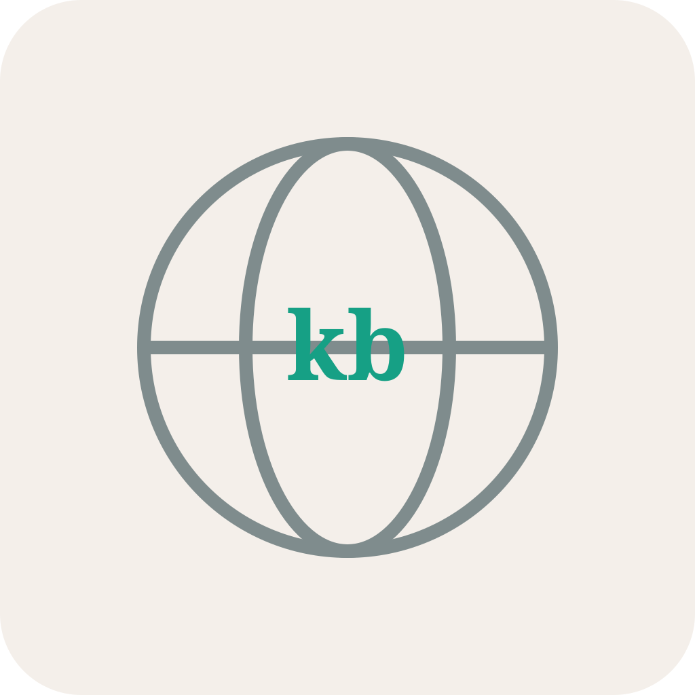

#  kb-web

A standalone web application and CLI wrapper for the Knowledge Base (kb) ecosystem. It provides a FastAPI web portal for capturing and importing web pages, cleaning them using Ollama LLM agents, searching the archive, and streaming database exports.

## Core Features

- **Global Authentication & Site Security Guard**: Secures the entire web application behind admin password authentication. Unauthenticated requests are redirected with 303 to `/login?next={url}`. API and media endpoints require valid session cookies or API keys (`X-API-Key` or `Authorization: Bearer <key>`).
- **PWA Web Ingestion Target**: Registers as a share target on mobile and desktop web browsers, enabling authenticated quick clicks to ingest URLs directly.
- **Chrome Browser Extension Ingest**: Features an unpackaged Chrome extension targeting `/api/import/html` with `X-API-Key` header authentication to instantly post raw tab HTML, bypassing JavaScript obstacles.
- **AI Wiki Conversion**: Rewrites raw scraped web pages into clean, highly structured markdown wiki entries starting with H1 titles `# Title` using Ollama.
- **Tag Curation & Editing**: Automates tag generation through Ollama classification prompts and allows manual tag updates inside the UI.
- **Source Page Re-fetching with Version Snapshots**: Re-fetches the page URL. If successful, archives the current copy in `page_versions` and updates the latest page with the newly ingested content; otherwise, rolls back and retains the original page.
- **Secure Password & Credential Manager**: Allows logged-in administrators to change the passcode after verifying current credentials from the web UI, backed by constant-time verification.
- **Brute-Force Login Rate Limiting**: Sliding window rate limiter guarding `/login` against automated credential stuffing (5 failed attempts per 60s per IP triggers HTTP 429).
- **HTTP Security Headers & Path Hardening**: Injects `X-Content-Type-Options: nosniff`, `X-Frame-Options: SAMEORIGIN`, and strict referrer policies on all responses. Blocks ZipSlip archive extraction attacks and virtual filesystem traversal.
- **Interactive Action Triggers**: Supports 1-click Wiki, Tag, and source URL re-fetching / re-generation directly on the page view profile.
- **Administrative Settings Portal**: Prefills and updates Ollama hosts/models, system prompts, API keys, and Gotify details directly from the Web UI with default-credential warning banners.
- **Chunked WS Ingest**: Supports uploading JSON database backups over WebSockets.
- **JSON Streams**: Streams database records out as downloadable files.
- **Standardized REST API Suite**: High-performance JSON endpoints (`/api/articles`, `/api/videos`, `/api/sites`, `/api/tags`) for external AI agents and frontend consuming.
- **PostgreSQL & Database View Optimization**: Pre-aggregated database view (`vw_page_cards`) and indexes to eliminate latency and N+1 queries. Note: SQLite is being phased out in favor of PostgreSQL as the primary production engine.
- **Semantic RAG Chunk Search**: High-dimensional chunk vector search across articles, notes, and videos directly from the homepage with jump-link document anchor highlights.
- **Multi-Model Embeddings & Comparison**: Side-by-side vector model comparison explorer (`/similarity/compare`), background reindexing, and active model source toggling.
- **Article Chat & Conversations Hub**: Sliding interactive Ollama chat drawer on articles and global dashboard (`/conversations`) preserving persistent discussion threads.
- **Personal Knowledge Notes & Monaco Editor**: Note and code paste ingestion (`/notes`), directory tree grouping, integrated full-page Monaco Editor (`/notes/editor`), and Obsidian vault `.zip` mirroring.
- **Admin Portal Tabbed Layout**: Ergonomic, 5-tab dashboard with persistent tab state across General, Prompts, Backups, Media, and Diagnostics.
- **Custom Report Builder & ERP Data Grid**: Multi-table data grid (`/reports`) with dynamic joins, filtering, saved views, and high-volume streaming exports in `.csv`, `.json`, and native Excel `.xlsx`.
- **In-Browser Replit-Lite Workspaces & Pyodide Python WASM**: Full browser-based coding studio (`/workspaces`) with persistent multi-file workspaces stored in the database, Monaco Editor, live Pyodide Python 3 WASM execution runtime, sandboxed HTML/JS preview with console log interceptor, ZIP archive bundling, and ephemeral Ollama coding agent with interactive diff review and merge.

---

## Codebase Structure

- `src/kb_web/config.py`: Configuration class extending the base `kb_core` configuration to support LLM, API keys, and web UI variables.
- `src/kb_web/models_orm.py`: SQLAlchemy ORM models, pgvector type decorator, and `vw_page_cards` view schema.
- `src/kb_web/models.py`: Pydantic validation schemas (`ParsedUrl` and `HTMLPage`) representing stored pages.
- `src/kb_web/server.py`: FastAPI application routing, route guards, and background tasks.
- `src/kb_web/routers/rest_api.py`: Public JSON REST API endpoints (`/api/articles`, `/api/videos`, `/api/sites`, `/api/tags`).
- `src/kb_web/routers/pages.py`: Web UI page controller with pagination and virtual site indexing.
- `src/kb_web/routers/conversations.py`: Persistent article-level and global Ollama chat conversations.
- `src/kb_web/routers/embeddings.py`: Multi-model embedding management, reindexing, and side-by-side comparison.
- `src/kb_web/routers/notes.py`: Personal knowledge notes, code paste ingestion, and Obsidian vault archives.
- `src/kb_web/routers/reports.py`: Dynamic report builder, multi-table joins, and streaming data exports.
- `src/kb_web/routers/workspaces.py`: Persistent in-browser IDE workspaces, starter templates, file sync, ZIP export, and Ollama agent integration.
- `src/kb_web/cli.py`: Typer command launcher.
- `src/kb_web/templates/`: Jinja2 templates for login, dashboard lists, configuration inputs, and profile views.
- `browser_extension/`: Source directory containing manifest, options menu, and background worker for Chrome imports.
- `kb-web.service`: Systemd service template for Linux deployments.

---

## Git Branching & Release Lifecycle

The repository uses a 3-tier branch architecture to guarantee stability and reliable releases:
1. **`development`**: Primary trunk branch for active day-to-day feature work.
   - All feature, bugfix, and sprint branches (`feature/...`, `fix/...`) branch off `development`.
   - Work is submitted via draft PRs targeting `development`.
2. **`production`**: Pre-release staging and verified production baseline.
   - Merged from `development` once all automated test suites, UI component checks, and UAT pass cleanly.
3. **`master`**: Long-term stable release line.
   - Merged from `production` when major, tagged milestone releases are cut.

---

## Security & Hardening Architecture

When deployed to public networks or the open internet, `kb-web` enforces multi-layer defense-in-depth security controls:

### 1. Global Full-Site Authentication Guard
All web views, media assets, personal notes, in-browser workspaces, and API endpoints are fully gated:
- **UI Web Routes**: Any unauthenticated request to UI endpoints (`/`, `/pages`, `/notes`, `/workspaces`, `/similarity/...`, `/reports`, `/collections`, etc.) is intercepted by middleware and redirected with HTTP `303 See Other` to `/login?next={requested_url}`.
- **REST & Internal APIs**: Unauthenticated calls to `/api/...` return HTTP `401 Unauthorized` with JSON error messages. Clients can authenticate using either a valid session cookie (`kb_session`) or an API key passed via `X-API-Key` or `Authorization: Bearer <key>`.
- **Media Asset Gating**: All files under `/media/...` require authentication, preventing unauthorized access to personal attachments and downloaded video files.
- **Public Allowlist**: Gated access is strictly exempted only for login flow and essential PWA resources: `/login`, `/logout`, `/favicon.ico`, `/icon.png`, `/manifest.json`, and `/sw.js`.

### 2. Session Cookies & Rate Limiting
- **Cookie Security**: Authentication session tokens (`kb_session`) are signed and set with `HttpOnly=True`, `SameSite=Lax`, and dynamically enabled `Secure=True` whenever HTTPS is detected directly or through reverse-proxy headers (`X-Forwarded-Proto: https`).
- **Brute-Force Rate Limiting**: The `POST /login` endpoint employs an in-memory sliding-window rate limiter per client IP. More than 5 failed authentication attempts within a 60-second window triggers an immediate HTTP `429 Too Many Requests`.
- **Constant-Time Verification**: All password and API key checks utilize `hmac.compare_digest` to prevent side-channel timing attacks.

### 3. HTTP Security Headers
Every HTTP response automatically includes enterprise security headers:
- `X-Content-Type-Options: nosniff` (prevents MIME-type sniffing)
- `X-Frame-Options: SAMEORIGIN` (prevents clickjacking attacks)
- `X-XSS-Protection: 1; mode=block` (legacy XSS filtering)
- `Referrer-Policy: strict-origin-when-cross-origin` (prevents URL parameter leakage across domains)

### 4. Path Traversal & ZipSlip Safeguards
- **Obsidian Vault Archives**: Zip file extractions under `/api/notes/upload-vault` sanitize all archive member paths against directory traversal (`..`) and enforce target path canonicalization before writing files to disk.
- **Virtual Workspaces**: Workspace file CRUD endpoints (`/api/workspaces/...`) enforce path component validation to disallow directory escapes outside the workspace context.

### 5. Default Credential Alerts
The application actively detects whether default development credentials (`admin123` or `kb-secret-key`) remain active, logging security warnings on server boot and rendering prominent dismissible alert banners in the Admin Portal.

### 6. High-Contrast Muted Neon Dark Mode
The web interface features an integrated site-wide theme engine with an interactive circular Moon/Sun toggle in the navigation bar. Supports:
- **Aesthetic**: Deep slate/obsidian palette (`#090e17` / `#111827`) with crisp high-contrast typography and muted neon accents (electric cyan, neon violet, emerald, amber, rose).
- **Persistence**: Persists preference across page visits via `localStorage` with zero-flash (`prefers-color-scheme`) theme loading.


---

## Configuration Settings

The application is configured using environment variables, or alternatively, by placing a configuration file at `~/.kb/configs/kb-web.json` (editable directly inside the Admin portal).

| Variable | Default Value | Description |
|---|---|---|
| `KB_PASSWORD` | `admin123` | Passcode protecting administrative pages and imports. |
| `KB_API_KEY` | `kb-secret-key` | Token required in headers for Chrome Extension posts. |
| `KB_OLLAMA_HOST` | `http://localhost:11434` | Endpoint pointing to the Ollama server. |
| `KB_OLLAMA_MODEL` | `gemma4:latest` | LLM model target for wiki entries and tags. |
| `GOTIFY_URL` | None | Gotify host server address. |
| `GOTIFY_TOKEN` | None | Gotify application token. |
| `KB_WIKI_PROMPT` | System prompt | Custom prompt template for LLM cleanups. |

---

## Local Development

### 1. Synchronize Dependencies
Sync your virtual environment using `uv`:
```bash
uv sync
```

### 2. Launch Local Server
Use the CLI to launch the FastAPI application in development mode:
```bash
uv run kb-web serve --port 8050 --reload
```

Then visit `http://localhost:8050/pages` to view the archive index or `http://localhost:8050/` to log in and import new URLs.

---

## Database & Media CLI Commands (`kb-web db`)

`kb-web` provides a dedicated `db` command suite for database migration, PostgreSQL replication, snapshot backups, and YouTube video management:

```bash
# Migrate legacy SQLite database to PostgreSQL (targets: 'dev', 'test', or 'live')
uv run kb-web db migrate-sqlite --target test

# Deploy Alembic migrations across targets ('dev', 'test', 'live', or 'all')
uv run kb-web db deploy --target all

# Export point-in-time multi-table JSON database snapshot to ~/.kb/kb-web_backups/
uv run kb-web db snapshot --target live

# Sync live database snapshot directly into test database
uv run kb-web db sync-snapshot

# Setup PostgreSQL streaming logical publication and subscription
uv run kb-web db replication-setup

# Inspect PostgreSQL replication slots, publications, and subscription status
uv run kb-web db replication-status --target test

# Backup all local YouTube videos into a ZIP archive (strict max 2 archives retention)
uv run kb-web db backup-videos

# Restore YouTube videos from backup ZIP into ~/.kb/media/videos and re-index
uv run kb-web db restore-videos kb_videos_backup_20260908_120000.zip

# Re-scan ~/.kb/media/videos and associate video files with database records
uv run kb-web db reindex-videos
```

---

## CLI Client Station (kb-cli / kb-web-cli)

`kb-web` includes a standalone console tool `kb-web-cli` for managing the server remotely:

- **Installation**: `kb-web-cli install` (prompts for server URL and CLI API key generated from Admin Dashboard).
- **Remote Server Restart**: `kb-web-cli restart` (sends authenticated remote restart trigger and polls `/api/health` until restored).
- **View Server Logs**: `kb-web-cli logs --limit 100` (inspect server logs remotely; limit choice is saved locally).
- **Ingest URL**: `kb-web-cli import <url>`
- **Query RAG Agent**: `kb-web-cli query "<prompt>"`
- **List Items**: `kb-web-cli list`
- **Actions**: `kb-web-cli action <action> <url>`
- **Collections**: `kb-web-cli collections --list`
- **Tags**: `kb-web-cli tags --list`
- **Workspace Snapshots & Agent Harness**:
  - `kb-web-cli workspace snapshots <ws_id>`: List all tagged snapshots for a workspace.
  - `kb-web-cli workspace snapshot <ws_id> --tag v1.0.0 --desc "Stable release"`: Create an immutable tagged snapshot.
  - `kb-web-cli workspace freeze <ws_id> <snapshot_id>`: Freeze snapshot and publish directly as a Knowledge Base article (`workspace://`).
  - `kb-web-cli workspace agent <ws_id>`: Launch interactive terminal coding agent paired with native `ollama.systemone` `tev1` decision routing and file tool execution.
- **Autonomous Agentic RAG Reports**:
  - `kb-web-cli rag report "<query>"`: Run multi-sub-agent retrieval (taxonomy tags, vector embeddings, full-text) with `tev1` decision matrix vetting (up to 64 questions per turn) and synthesize publication-grade research reports. Supports `--purpose`, `--output`, `--model`, and `--save-notes`.

---

## Chrome Browser Extension Setup

To load the manual sync browser extension on your local machine:

1. Open your browser's extensions page (`chrome://extensions/` for Chrome).
2. Enable **Developer mode** using the toggle in the top-right corner.
3. Click **Load unpacked** in the top-left corner.
4. Select the directory `/srv/kb-web/browser_extension` (or local equivalent).
5. Open the Extension Options page to configure:
   - **FastAPI API Endpoint URL**: `http://localhost:8050/api/import/html`
   - **Ingestion API Key**: matching `KB_API_KEY` (default: `kb-secret-key`)
6. Click the extension toolbar icon on any webpage to sync its HTML content. The icon badge indicates status: "SYNC" (blue), "OK" (green), "ERR" (red).

---

## Running Automated Tests

Run the test suite to verify route parsing and model constraints:
```bash
uv run pytest
```

> [!NOTE]
> Gotify alerts are globally mocked during automated test runs via `tests/test_server.py` to prevent spamming notification channels. However, if you are running tests in an environment where you want to be completely sure no notifications leak, you should unset the `GOTIFY_URL` and `GOTIFY_TOKEN` environment variables:
> - **Windows (PowerShell)**: `$env:GOTIFY_URL=""; $env:GOTIFY_TOKEN=""`
> - **Linux/macOS**: `GOTIFY_URL="" GOTIFY_TOKEN="" uv run pytest`

---

## Production Linux Server Deployment (Git Flow)

This codebase is deployed on a Linux server by cloning the repository to `/srv/kb-web/`.

### External Dependencies
For full YouTube link metadata and transcript extraction support, the production server requires:
- **`ffmpeg`**: Required by `yt-dlp` to download, convert, and merge video streams correctly.
- **JavaScript Runtime (`deno` or `node.js`)**: Required by `yt-dlp` to execute YouTube signature scripts for media extraction.

The provided service installation script (`scripts/install_service.sh`) will automatically check for and attempt to install these packages system-wide if run with sudo.

### 1. Clone & Set Ownership
Ensure the repository is checked out at `/srv/kb-web` and owned by your system user:
```bash
# Clone or move the repository
sudo git clone <repo_url> /srv/kb-web
sudo chown -R will:will /srv/kb-web
```

### 2. Setup Virtual Environment & Install
Synchronize the virtual environment and dependencies using `uv`:
```bash
cd /srv/kb-web
uv sync
```

### 3. Scaffolding Environment Variables
Create the environment configuration file:
```bash
cat <<EOF > /srv/kb-web/.env
KB_PASSWORD=your_secure_password
KB_API_KEY=your_extension_auth_key
KB_OLLAMA_HOST=http://localhost:11434
# GOTIFY_URL=http://your-gotify-server
# GOTIFY_TOKEN=your-token
EOF
```

### 4. Configure Systemd Service
Copy the systemd configuration file and reload the daemon:
```bash
sudo cp /srv/kb-web/kb-web.service /etc/systemd/system/kb-web.service
sudo systemctl daemon-reload
```

### 5. Manage Service
Enable and start the daemon:
```bash
sudo systemctl enable --now kb-web

# To check logs or status
sudo systemctl status kb-web
sudo journalctl -u kb-web -f
```
